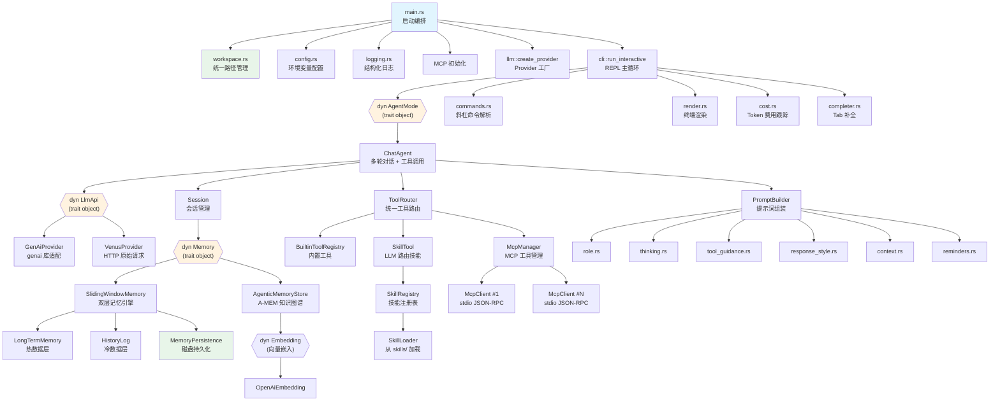

# 架构总览

## 总览

Daedalus 是一个终端 AI 助手，采用 **分层架构 + Trait 抽象** 的设计模式。系统由 CLI 表现层、Agent 编排层、LLM/MCP/Memory 基础设施层三个层次组成，各层通过 trait 接口解耦，实现了 Provider 无关、记忆策略可插拔、Agent 模式可扩展的架构目标。

## 架构图



## 组件说明

| 组件 | 职责 | 技术栈 | 代码位置 | 详细文档 |
|------|------|--------|---------|---------|
| main.rs | 启动编排：workspace → 日志 → 配置 → MCP → LLM → REPL | tokio | `src/main.rs` | [core](docs/services/core/overview.md) |
| workspace | 统一路径管理（配置、记忆、日志、技能） | std::fs | `src/workspace.rs` | [core](docs/services/core/overview.md) |
| config | 环境变量配置加载（支持 workspace 回退） | anyhow | `src/config.rs` | [core](docs/services/core/overview.md) |
| logging | 结构化日志（双通道、轮转） | tracing, tracing-appender | `src/logging.rs` | [core](docs/services/core/overview.md) |
| agent | Agent 模式抽象 + ChatAgent + ToolRouter | async-trait | `src/agent/` | [agent](docs/services/agent/overview.md) |
| tools | 内置工具 trait + 文件系统工具 | tokio::fs, chrono | `src/tools/` | [agent](docs/services/agent/overview.md) |
| skill | Skill 加载 + 注册 + LLM 路由 | — | `src/skill/` | [agent](docs/services/agent/overview.md) |
| cli | REPL 交互、命令解析、终端渲染 | rustyline, crossterm, termimad | `src/cli/` | [cli](docs/services/cli/overview.md) |
| llm | LLM Provider 抽象 + 双 Provider 实现 | genai, reqwest | `src/llm/` | [llm](docs/services/llm/overview.md) |
| mcp | MCP 协议客户端 + 工具管理 | tokio, serde_json | `src/mcp/` | [mcp](docs/services/mcp/overview.md) |
| memory | 会话记忆抽象 + 双层记忆引擎 + A-MEM 知识图谱 + 持久化 | serde, serde_json | `src/memory/` | [memory](docs/services/memory/overview.md) |
| embedding | 文本向量嵌入抽象 + OpenAI 实现 | reqwest | `src/embedding/` | [memory](docs/services/memory/overview.md) |
| prompt | 系统提示词动态组装 | — | `src/prompt/` | [prompt](docs/services/prompt/overview.md) |
| session | 会话状态管理 | chrono, uuid | `src/session.rs` | [core](docs/services/core/overview.md) |

## 关键数据流

### 场景 1：用户发送消息（无工具）

```
用户输入 → REPL.handle_chat()
  → agent.chat(input)
    → session.memory_mut().add_user_message()
    → session.memory().build_messages()  // 系统提示 + 历史
    → llm.chat(messages)                 // 发送到 LLM
    → session.memory_mut().add_assistant_message()
  ← ChatResponse
  → render.response()                   // Markdown 渲染
  → render.response_footer()            // token 统计
```

### 场景 2：用户发送消息（有工具）

```
用户输入 → REPL.handle_chat()
  → agent.chat(input, tool_callback)
    → chat_with_tools(messages, on_tool_event)
      → LOOP (最多 10 轮):
        → llm.chat_with_tools(messages, tools, tool_history)
        → 如果 response.tool_calls 非空:
          → 发送 RoundStart 事件
          → 发送所有 ToolCallStart 事件
          → 并行执行所有工具 (futures::join_all)
            → tool_router.execute(call)
              → 优先查找 built-in 工具
              → 回退到 MCP 服务器
          → 发送所有 ToolCallComplete 事件
          → 发送 RoundComplete 事件
          → 收集 ToolResponse
          → tool_history.push(ToolRound { calls, responses })
          → 继续循环
        → 如果无 tool_calls: 返回最终文本响应
    → memory.add_tool_context(summary)
    → memory.add_assistant_message(content)
  ← ChatResponse (累计 token usage)
```

### 场景 3：启动流程

```
main()
  1. Workspace::resolve()    → 解析 workspace（env → .daedalus/ → ~/.daedalus/）
  2. logging::init()         → 初始化日志（默认写入 workspace/logs/）
  3. AgentConfig::from_env_with_workspace() → 加载配置 + SOUL 文件
  4. McpConfig::load_with_workspace()       → 搜索 mcp.json（env → ./ → workspace → ~/.config/）
  5. McpManager::from_config() → 并行连接所有 MCP 服务器
  6. llm::create_provider()  → 选择 GenAi 或 Venus
  7. ChatAgent::new_with_workspace() → 创建 Agent + 从 workspace 加载持久化记忆
  8. agent.attach_mcp()      → 附加 MCP + 重建提示词
  9. agent.load_skills()     → 从 workspace/skills/ + cwd/skills/ 加载技能
  10. cli::run_interactive() → 进入 REPL 主循环
  11. agent.shutdown()       → 退出时持久化记忆到 workspace + 关闭 MCP 子进程
```

## 技术栈概览

- **语言**：Rust 2024 edition (1.85+)
- **异步运行时**：tokio 1.44 (full features)
- **并行工具执行**：futures 0.3（join_all）
- **LLM 适配**：genai 0.5.3（多 Provider 适配器）、reqwest 0.12（Venus HTTP 直连）
- **终端交互**：rustyline 15.0（行编辑 + 补全）、crossterm 0.28（ANSI 样式）、termimad 0.30（Markdown 渲染）、indicatif 0.17（进度条/spinner）
- **序列化**：serde 1.0 + serde_json 1.0
- **日志**：tracing 0.1 + tracing-subscriber 0.3 + tracing-appender 0.2
- **其他**：anyhow（错误处理）、async-trait（异步 trait）、chrono/time（时间）、uuid（会话 ID）

## 设计原则

1. **Trait 抽象优先**：核心接口（`AgentMode`、`LlmApi`、`Memory`）均定义为 trait，实现通过 trait object（`Box<dyn T>`）注入，支持运行时多态和未来扩展。Memory trait 通过 `as_any` downcast 支持策略特定功能访问。
2. **依赖注入**：`ChatAgent` 通过构造函数接收 LLM provider 和 MemoryFactory，不硬编码任何具体实现。
3. **单一职责**：每个模块/文件有明确的职责边界（如 `render.rs` 只管输出，`commands.rs` 只管解析）。
4. **优雅降级**：MCP 连接失败跳过该服务器、SOUL 文件读取失败仅 warn、日志 filter 解析失败回退默认值。
5. **OpenAI JSON 作为中间格式**：工具定义使用 OpenAI function-calling JSON 作为 Provider 无关的中间表示，各 Provider 各自转换。
6. **近因效应利用**：系统提示词中 Critical Reminders 放在最后，利用 LLM 的近因偏差确保硬规则最被重视。
7. **内置工具始终可用**：文件系统等基础工具通过 `BuiltinToolRegistry` 内置，无需外部 MCP 配置即可使用。工具路由优先级：内置工具 > MCP 工具。
8. **工具调用并行执行**：同一轮中的多个工具调用通过 `futures::future::join_all` 并行执行，总耗时 = max(各工具耗时)。
9. **工具执行可观测性**：通过 `ToolEvent` 回调机制，CLI 层实时渲染工具执行进度（开始/完成/成功/失败）。
10. **Skill 即工具（LLM 路由）**：Skill 不静态注入 system prompt（浪费 token），而是作为 `use_skill` 内置工具暴露给 LLM，由 LLM 根据 skill 描述自主决定何时调用。Skill 通过 `BuiltinTool` trait 适配器模式集成，ToolRouter 无需特殊分支。
11. **Workspace 统一路径管理**：所有 Daedalus 产生/消费的文件（配置、记忆、日志、技能）通过 `Workspace` 获取路径。支持三级优先级：环境变量 > 项目级 `.daedalus/` > 全局 `~/.daedalus/`。Workspace 是纯路径管理器，不持有业务逻辑。
12. **记忆持久化**：LongTermMemory（JSON）、HistoryLog（JSONL 追加写入）、AgenticMemoryStore（JSON）均支持磁盘持久化。通过 `MemoryPersistence` trait 统一接口，启动时自动加载、退出时自动保存。持久化使用原子写入（write-to-temp-then-rename）防止进程崩溃导致数据损坏。`Memory` trait 提供 `persist()` 方法，shutdown 时无需 downcast 到具体类型。
13. **优雅关闭**：`agent.shutdown()` 依次执行记忆持久化和 MCP 子进程关闭，防止孤儿进程。
