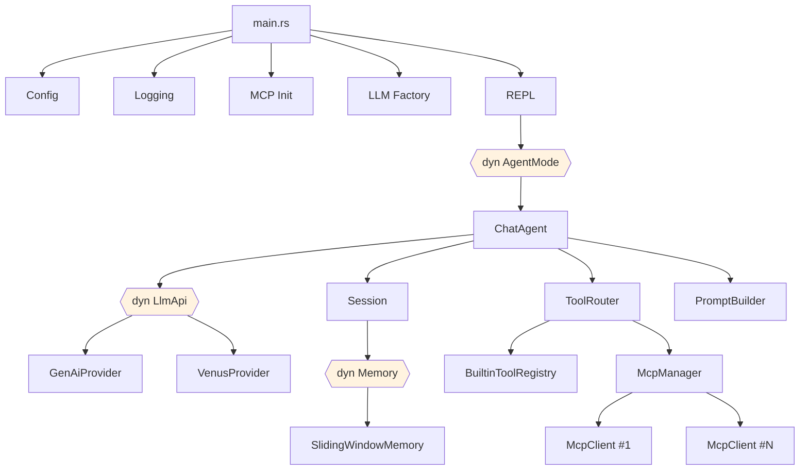

<p align="center">
  <h1 align="center">🏛️ Daedalus</h1>
  <p align="center">
    <strong>A blazing-fast terminal AI assistant built in Rust</strong>
  </p>
  <p align="center">
    Multi-provider LLM · MCP Tool Use · Built-in File Operations · Thinking Mode · Pluggable Memory
  </p>
</p>

<p align="center">
  <a href="#-quick-start">Quick Start</a> •
  <a href="#-features">Features</a> •
  <a href="#%EF%B8%8F-configuration">Configuration</a> •
  <a href="#-tool-system">Tool System</a> •
  <a href="#-architecture">Architecture</a> •
  <a href="#-development">Development</a>
</p>

---

Daedalus is a [Claude Code](https://docs.anthropic.com/en/docs/claude-code)-inspired terminal AI assistant that brings multi-turn conversations, tool use, and rich Markdown rendering to your terminal. It supports multiple LLM providers, extends capabilities through the [Model Context Protocol (MCP)](https://modelcontextprotocol.io/), and ships with built-in file system tools — all in a single, dependency-light Rust binary.

## 🚀 Quick Start

```bash
# 1. Build
cargo build --release

# 2. Set your API key
export OPENAI_API_KEY="sk-..."

# 3. Run
cargo run --release
```

That's it. Daedalus starts an interactive REPL with the default `gpt-4o` model. Type a message and press Enter.

```
🏛️ Daedalus  v0.1.0

  Model:    gpt-4o  (GenAI)
  Mode:     chat
  Tools:    5 built-in, 3 MCP
  Session:  Session 2026-04-08 11:00:00 (a1b2c3d4)

  Type /help for available commands.

>
```

## ✨ Features

### Core

- **Interactive REPL** — Claude Code-style terminal with slash commands, Tab completion, and inline ghost hints
- **Multi-turn Conversations** — Full conversation history with pluggable memory strategies (sliding window, unlimited)
- **Rich Terminal Output** — Markdown rendering, syntax-highlighted code blocks, thinking process display (💭), spinners, and ANSI-styled output
- **Token Tracking** — Per-session prompt/completion token usage and cost monitoring

### LLM Providers

- **Provider Agnostic** — Pluggable `LlmApi` trait with two built-in implementations:
  - **GenAiProvider** — Via [genai](https://crates.io/crates/genai) library, supports OpenAI, Anthropic, Gemini, Groq, Cohere
  - **VenusProvider** — Raw HTTP for full control over Venus/OpenAI-compatible APIs with extended parameters
- **Thinking Mode** — First-class support for reasoning models (DeepSeek-R1, Claude with extended thinking), with configurable thinking tokens and reasoning effort
- **Auto Provider Selection** — Automatically chooses VenusProvider when thinking parameters are configured

### Tool System

- **Built-in Tools** — 5 file system tools ship out of the box, no external setup required
- **MCP Protocol** — Connect to any [MCP-compatible](https://modelcontextprotocol.io/) tool server via stdio
- **Unified Routing** — `ToolRouter` transparently routes tool calls: built-in tools first, MCP fallback
- **Multi-round Tool Use** — Up to 10 tool-calling rounds per message, with automatic token accumulation
- **Graceful Degradation** — Failed MCP servers are skipped; other servers continue working

### Personalization

- **Soul System** — Load a `SOUL.md` personality file to customize the assistant's persona
- **Custom Agent Name** — Rename the assistant from "Daedalus" to anything
- **Dynamic Prompt Assembly** — 7-section XML-structured system prompt, auto-adapted based on available tools and configuration

## 🔧 Tool System

### Built-in Tools

These tools are always available, with zero configuration:

| Tool | Description |
|------|-------------|
| `read_file` | Read file contents with optional line offset and limit |
| `write_file` | Write content to a file (auto-creates parent directories) |
| `list_directory` | List directory contents, with optional recursion and entry limit |
| `search_files` | Search for files by name pattern |
| `get_file_info` | Get file/directory metadata (size, timestamps, permissions) |

### MCP Tools

Connect external tool servers via a JSON config file. Daedalus uses the same config format as Claude Code and Cursor:

```json
{
  "mcpServers": {
    "filesystem": {
      "command": "npx",
      "args": ["-y", "@modelcontextprotocol/server-filesystem", "/tmp"],
      "env": {}
    },
    "github": {
      "command": "npx",
      "args": ["-y", "@modelcontextprotocol/server-github"],
      "env": {
        "GITHUB_TOKEN": "ghp_..."
      }
    }
  }
}
```

Config file search order:
1. `$DAEDALUS_MCP_CONFIG` environment variable
2. `./mcp.json` (current directory)
3. `~/.config/daedalus/mcp.json` (user config)

MCP servers are connected **in parallel** at startup. Failed connections are logged and skipped — they never block other servers.

### Tool Routing

When the LLM requests a tool call, `ToolRouter` resolves it in priority order:

```
LLM tool_call → ToolRouter
  ├─ Built-in registry match? → Execute locally (zero overhead)
  ├─ MCP server match?       → Route to MCP server via stdio
  └─ No match                → Return error to LLM
```

## 💬 Usage

### Slash Commands

| Command | Aliases | Description |
|---------|---------|-------------|
| `/help` | `/h`, `/?` | Show available commands |
| `/new` | `/compact` | Start a new session (clears history and cost) |
| `/clear` | — | Clear the screen (keeps history) |
| `/cost` | — | Show token usage for the current session |
| `/model` | — | Show current model and provider info |
| `/tools` | — | List all available tools (built-in + MCP) |
| `/exit` | `/quit` | Exit the application |

### Keyboard Shortcuts

| Key | Action |
|-----|--------|
| `Tab` | Auto-complete slash commands |
| `Ctrl-C` | Cancel current input (does not exit) |
| `Ctrl-D` | Exit gracefully |
| `quit` / `exit` | Exit (without slash) |

## ⚙️ Configuration

All configuration is via environment variables. No config files required (except optional MCP).

### LLM & Agent

| Variable | Required | Default | Description |
|----------|:--------:|---------|-------------|
| `OPENAI_API_KEY` | ✅ | — | API key for the LLM provider |
| `DAEDALUS_MODEL` | | `gpt-4o` | Model identifier |
| `OPENAI_BASE_URL` | | — | Custom API base URL (for proxies, Azure, etc.) |
| `DAEDALUS_ADAPTER_KIND` | | `openai` | LLM adapter: `openai`, `anthropic`, `gemini`, `groq`, `cohere` |
| `DAEDALUS_SYSTEM_PROMPT` | | — | Override the dynamic system prompt entirely |
| `DAEDALUS_AGENT_NAME` | | `Daedalus` | Custom assistant name |
| `DAEDALUS_SOUL_FILE` | | — | Path to a SOUL.md personality file |

### Thinking Mode

Enable reasoning/thinking capabilities for supported models:

| Variable | Default | Description |
|----------|---------|-------------|
| `DAEDALUS_THINKING_ENABLED` | `false` | Enable thinking mode (`true`/`false`) |
| `DAEDALUS_THINKING_TOKENS` | — | Max tokens for the thinking process (e.g., `2048`) |
| `DAEDALUS_REASONING_EFFORT` | — | Reasoning effort level: `low`, `medium`, `high` |

> **Note:** Setting `DAEDALUS_THINKING_ENABLED` or `DAEDALUS_THINKING_TOKENS` automatically switches to VenusProvider for full request control.

### MCP

| Variable | Default | Description |
|----------|---------|-------------|
| `DAEDALUS_MCP_CONFIG` | — | Explicit path to MCP config JSON file |

### Logging

| Variable | Default | Description |
|----------|---------|-------------|
| `RUST_LOG` | `daedalus=debug` | Standard `tracing` filter directive |
| `DAEDALUS_LOG_FORMAT` | `pretty` | Stderr format: `pretty`, `compact`, `json`, `full` |
| `DAEDALUS_LOG_DIR` | *(disabled)* | Enable file logging to this directory |
| `DAEDALUS_LOG_FILE_PREFIX` | `daedalus` | Log file name prefix |
| `DAEDALUS_LOG_ROTATION` | `daily` | Rotation: `minutely`, `hourly`, `daily`, `never` |
| `DAEDALUS_LOG_FILE_FORMAT` | `json` | File log format: `pretty`, `compact`, `json`, `full` |
| `DAEDALUS_LOG_FILE` | `false` | Show source file path in logs |
| `DAEDALUS_LOG_LINE` | `false` | Show line numbers in logs |
| `DAEDALUS_LOG_TARGET` | `true` | Show target module path |
| `DAEDALUS_LOG_THREAD_NAMES` | `false` | Show thread names |
| `DAEDALUS_LOG_ANSI` | `true` | Use ANSI colors (stderr only) |

### Example Configurations

```bash
# Minimal — OpenAI with defaults
export OPENAI_API_KEY="sk-..."
cargo run --release

# Anthropic Claude via genai adapter
export OPENAI_API_KEY="sk-ant-..."
export DAEDALUS_ADAPTER_KIND="anthropic"
export DAEDALUS_MODEL="claude-sonnet-4-20250514"
cargo run --release

# Thinking mode with Venus-compatible proxy
export OPENAI_API_KEY="your-key"
export OPENAI_BASE_URL="https://your-proxy.example.com/v1"
export DAEDALUS_THINKING_ENABLED="true"
export DAEDALUS_THINKING_TOKENS="4096"
export DAEDALUS_REASONING_EFFORT="high"
cargo run --release

# Custom personality
export DAEDALUS_AGENT_NAME="Jarvis"
export DAEDALUS_SOUL_FILE="./SOUL.md"
cargo run --release

# Production logging
export DAEDALUS_LOG_DIR="./logs"
export DAEDALUS_LOG_ROTATION="hourly"
export DAEDALUS_LOG_FILE_FORMAT="json"
export RUST_LOG="daedalus=info"
cargo run --release
```

## 🏗️ Architecture



### Design Principles

| Principle | How |
|-----------|-----|
| **Trait Abstraction** | Core interfaces (`AgentMode`, `LlmApi`, `Memory`) are traits with `Box<dyn T>` injection |
| **Dependency Injection** | `ChatAgent` receives LLM provider and memory factory — no hard-coded implementations |
| **Single Responsibility** | Each module has one job: `render.rs` renders, `commands.rs` parses, `tool_router.rs` routes |
| **Graceful Degradation** | MCP failures skip servers, SOUL file failures warn, log filter failures use defaults |
| **OpenAI JSON as Lingua Franca** | Tool definitions use OpenAI function-calling JSON as the provider-neutral intermediate format |

### Project Structure

```
src/
├── main.rs                    # Entry point and startup orchestration
├── config.rs                  # Environment variable configuration
├── session.rs                 # Session state (ID, title, memory)
├── logging.rs                 # Structured logging with rotation
├── agent/
│   ├── mod.rs                 # AgentMode trait
│   ├── chat.rs                # ChatAgent — multi-turn chat + tool loop
│   └── tool_router.rs         # ToolRouter — unified tool dispatch
├── cli/
│   ├── repl.rs                # REPL main loop
│   ├── commands.rs            # Slash command parsing
│   ├── render.rs              # Terminal rendering (Markdown, styles)
│   ├── cost.rs                # Token usage tracking
│   └── completer.rs           # Tab completion + ghost hints
├── llm/
│   ├── mod.rs                 # LlmApi trait + provider factory
│   ├── types.rs               # ChatMessage, ToolCall, ChatResponse, etc.
│   ├── genai_provider.rs      # GenAI library adapter (multi-provider)
│   └── venus_provider.rs      # Raw HTTP Venus/OpenAI provider
├── mcp/
│   ├── config.rs              # MCP config file loading
│   ├── client.rs              # Single MCP server stdio client
│   ├── manager.rs             # Multi-server manager with routing
│   └── types.rs               # JSON-RPC 2.0 + MCP protocol types
├── memory/
│   ├── mod.rs                 # Memory trait
│   └── sliding_window.rs      # Sliding window implementation
├── prompt/
│   ├── mod.rs                 # PromptBuilder (7-section assembly)
│   └── sections/              # Individual prompt sections
│       ├── role.rs            # Agent identity and capabilities
│       ├── thinking.rs        # Reasoning methodology
│       ├── tool_guidance.rs   # Tool usage guidelines
│       ├── response_style.rs  # Output formatting rules
│       ├── context.rs         # Runtime context (date, memory)
│       └── reminders.rs       # Critical safety reminders
└── tools/
    ├── mod.rs                 # BuiltinTool trait + registry
    └── fs.rs                  # File system tools (5 tools)
```

## �️ Development

### Prerequisites

- **Rust** 2024 edition (1.85+)
- An **OpenAI-compatible API key**

### Build & Test

```bash
# Build
cargo build --release

# Run all tests (65 tests)
cargo test

# Lint
cargo clippy

# Debug run with verbose logging
RUST_LOG=daedalus=debug cargo run
```

### Tech Stack

| Category | Crate | Purpose |
|----------|-------|---------|
| Async Runtime | `tokio` 1.44 | Full-featured async runtime |
| LLM Adapter | `genai` 0.5.3 | Multi-provider LLM library |
| HTTP Client | `reqwest` 0.12 | Venus provider raw HTTP |
| Terminal | `rustyline` 15.0 | Line editing, history, completion |
| Rendering | `termimad` 0.30 | Terminal Markdown rendering |
| Styling | `crossterm` 0.28 | ANSI terminal styles |
| Logging | `tracing` 0.1 | Structured, async-aware logging |
| Serialization | `serde` + `serde_json` | JSON handling throughout |
| Error Handling | `anyhow` 1.0 | Ergonomic error chains |

## 📚 Documentation

Detailed design documentation is available in the [`docs/`](docs/) directory:

- **[Architecture Overview](ARCHITECTURE.md)** — System architecture, data flows, and design principles
- **[Agent Module](docs/services/agent/overview.md)** — AgentMode trait, ChatAgent, ToolRouter, built-in tools
- **[LLM Module](docs/services/llm/overview.md)** — LlmApi trait, GenAi/Venus providers, type system
- **[MCP Module](docs/services/mcp/overview.md)** — MCP protocol client, manager, configuration
- **[CLI Module](docs/services/cli/overview.md)** — REPL, commands, rendering, cost tracking
- **[Memory Module](docs/services/memory/overview.md)** — Memory trait, sliding window strategy
- **[Prompt Module](docs/services/prompt/overview.md)** — Dynamic prompt assembly with 7 sections
- **[Design Decisions](docs/design/daedalus-trait-based-architecture.md)** — Trait architecture, ToolRouter extraction, BuiltinTool design
- **[Coding Conventions](docs/rules/daedalus-coding-conventions.md)** — Naming rules, error handling, async patterns
- **[Runtime Constraints](docs/constraints/daedalus-runtime-constraints.md)** — Timeouts, limits, and hard-coded constants

## 📄 License

This project is private and not yet licensed for public distribution.
