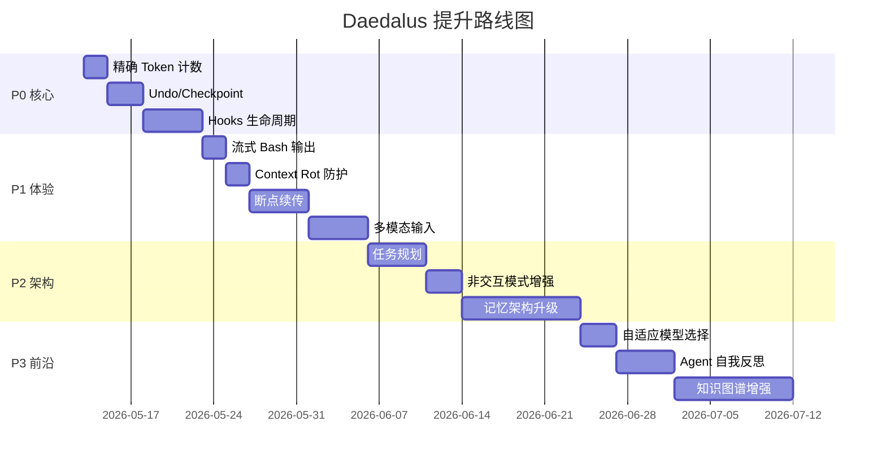

# Daedalus 提升路线图

> **日期**：2026-05-12（更新：2026-05-13）
> **版本**：v1.1
> **范围**：基于 ~50K 行代码的全面审查，结合 Claude Code 最新特性、2025-2026 业界前沿研究
>
> **v1.1 更新说明**：经代码交叉验证，P0 #1-#3 和 P1 #4-#5、#7 的现状描述与实际代码不符（功能已实现），已更新现状分析并标注剩余工作。同时修复了 `SerializableMessage` 丢失 `preserved`/`content_parts` 字段的真实 Bug。

---

## 目录

- [审查背景](#审查背景)
- [当前架构概览](#当前架构概览)
- [P0：核心能力缺失](#p0核心能力缺失)
  - [1. Hooks 生命周期系统](#1-hooks-生命周期系统)
  - [2. Undo/Checkpoint 机制](#2-undocheckpoint-机制)
  - [3. 精确 Token 计数](#3-精确-token-计数)
- [P1：体验与可靠性提升](#p1体验与可靠性提升)
  - [4. 流式 Bash 输出](#4-流式-bash-输出)
  - [5. 断点续传 / 任务恢复](#5-断点续传--任务恢复)
  - [6. Context Rot 防护](#6-context-rot上下文腐烂防护)
  - [7. 多模态支持](#7-多模态支持图片输入)
- [P2：架构演进](#p2架构演进)
  - [8. 分层记忆架构升级](#8-分层记忆架构升级对齐-lettamemgpt)
  - [9. 任务规划与分解](#9-任务规划与分解planning)
  - [10. 非交互模式增强](#10-非交互模式增强--print--ci-集成)
- [P3：前沿探索](#p3前沿探索)
  - [11. 自适应模型选择](#11-自适应模型选择model-router)
  - [12. Agent 自我反思](#12-agent-自我反思self-reflection)
  - [13. 知识图谱增强记忆](#13-知识图谱增强记忆)
- [总结矩阵](#总结矩阵)
- [建议实施顺序](#建议实施顺序)
- [参考资料](#参考资料)

---

## 审查背景

### 参考基准

| 来源 | 关键特性 | 时间 |
|------|---------|------|
| **Claude Code** | Hooks 8 大事件、`/undo`、SubagentStop、`--dangerously-skip-permissions` | 2025-2026 |
| **Letta/MemGPT** | 虚拟内存分页、Core/Archival Memory、Sleeptime 后台学习 | 2024-2026 |
| **Context Engineering** | 上下文五分类、Context Rot 概念、信息密度监控 | 2025-2026 |
| **Harness Engineering** | File As Progress、任务拆解→并行执行→多层重试 | 2026 |
| **Reflexion/LATS** | Agent 自我反思、失败后经验注入 | 2023-2024 |
| **上下文经济学** | 时间约束决定模型选择、自适应 model routing | 2026 |

### 审查方法

1. 全量代码扫描（190 个 `.rs` 文件，~50K 行）
2. 架构文档交叉验证（`ARCHITECTURE.md`、`docs/design/`）
3. 与 Claude Code 最新版本特性逐项对比
4. 与 2025-2026 学术论文和工程实践对比

---

## 当前架构概览

Daedalus 已具备的核心能力：

```
✅ Trait-based 架构（LlmApi、Memory、BuiltinTool、AgentMode）
✅ 中间件管道（Turn Pipeline + Tool Pipeline，洋葱模型）
✅ 流式输出（SSE 解析，StreamChunk → CLI 实时渲染）
✅ 三策略互斥记忆（sliding_window | dynamic_cheatsheet | agentic）
✅ 6 层上下文压缩体系（tool_history 截断 → compact → context_pressure）
✅ ACP 协议（Agent-to-Agent 通信，Phase 1-3 完整实现）
✅ 子代理系统（SubagentRunner + SubagentRegistry）
✅ 权限确认中间件（ConfirmationToolMiddleware）
✅ 工具并行执行（futures::future::join_all）
✅ 重复调用检测（DuplicateDetector，3 轮警告 / 5 轮终止）
✅ LLM 重试机制（指数退避，429/5xx 自动重试 3 次）
✅ 原子文件写入（write-to-temp-then-rename）
✅ 编辑工具 diff 输出（unified-diff 风格 + 行号报告）
```

---

## P0：核心能力缺失

### 1. Hooks 生命周期系统 ✅ 已部分实现（4/8 事件）

#### 现状分析

> ⚠️ **v1.1 更正**：原文称“用户无法自定义工具调用前后的行为”，实际 Hooks 系统已实现。

Daedalus 已实现完整的 `src/hooks/` 模块，支持 **4 个事件**：
- ✅ `PreToolUse`：工具执行前（可阻断）
- ✅ `PostToolUse`：工具执行后
- ✅ `SessionStart`：会话新建/恢复
- ✅ `Stop`：回答结束

已实现的基础设施：
- `src/hooks/config.rs`：YAML 配置驱动（`daedalus.yaml` 中的 `hooks` 字段）
- `src/hooks/executor.rs`：Shell 命令执行器（带超时和环境变量注入）
- `src/hooks/middleware.rs`：`HooksToolMiddleware` 已集成到 Tool Pipeline
- 支持 `matcher` 正则匹配工具名、环境变量注入、阻断能力、超时保护

**缺失的 4 个事件**：`UserPromptSubmit`、`Notification`、`SubagentStop`、`PreCompact`

#### Claude Code 参考

Claude Code 已实现 **8 大事件**的 Hooks 系统，通过 JSON 配置声明：

| 事件 | 触发时机 | 能否阻断 | 典型用途 |
|------|---------|---------|---------|
| `SessionStart` | 会话新建/恢复 | ❌ | 初始化环境 |
| `UserPromptSubmit` | 用户按回车前 | ✅ | 危险指令过滤 |
| `PreToolUse` | 工具准备执行前 | ✅ | 权限/审计 |
| `PostToolUse` | 工具执行结束 | ❌ | 自动格式化 |
| `Notification` | 需要用户输入 | ❌ | 桌面/Slack 通知 |
| `Stop` | 回答整体结束 | ❌ | 汇总日志 |
| `SubagentStop` | 子代理任务结束 | ❌ | 子任务统计 |
| `PreCompact` | 压缩对话缓存前 | ❌ | 备份历史 |

配置格式：

```json
{
  "hooks": {
    "PreToolUse": [
      {
        "matcher": "Bash",
        "hooks": [
          {
            "type": "command",
            "command": "echo \"Tool: $TOOL_NAME, Input: $TOOL_INPUT\" >> ~/.daedalus/audit.log"
          }
        ]
      }
    ],
    "PostToolUse": [
      {
        "matcher": "edit_file|write_file",
        "hooks": [
          {
            "type": "command",
            "command": "jq -r '.tool_input.path' | xargs prettier --write 2>/dev/null || true"
          }
        ]
      }
    ]
  }
}
```

#### 剩余实现方案

已有基础设施（`src/hooks/` 完整模块），只需扩展 `HookEvent` 枚举和对应的触发点：

| 缺失事件 | 触发位置 | 实现难度 |
|---------|---------|--------|
| `UserPromptSubmit` | `src/cli/repl.rs` 用户输入处理 | 低 |
| `Notification` | `src/agent/tool_loop/mod.rs` 需要用户输入时 | 低 |
| `SubagentStop` | `src/agent/subagent/runner.rs` 子代理完成时 | 低 |
| `PreCompact` | `src/memory/sliding_window/memory.rs` compact 前 | 低 |

#### 预估工作量

1-2 天（基础设施已就绪，只需添加事件和触发点）

---

### 2. Undo/Checkpoint 机制 ✅ 已实现

#### 现状分析

> ⚠️ **v1.1 更正**：原文称“没有保存修改前的内容”，实际已实现内存快照方案。

Daedalus 已实现 `src/tools/checkpoint.rs`（方案 B：内存快照）：
- ✅ `snapshot_before_write()` / `snapshot_with_content()`：写操作前保存文件内容
- ✅ `undo_last()`：回滚最近一次修改
- ✅ `REDO_STACK`：支持 redo
- ✅ 内存限制：最多 50 个 checkpoint，总计 100MB
- ✅ `edit_file.rs` 和 `multi_edit.rs` 已集成
- ✅ REPL 层已注册 `/undo` 斜杠命令

#### Claude Code 参考

Claude Code 支持 `/undo` 命令，基于 git 快照实现文件级回滚：
- 每次工具调用前自动创建 git stash 或内部快照
- `/undo` 回滚最近一次文件修改
- 支持回滚到指定轮次

#### 学术参考

Harness Engineering（2026）提出 **"File As Progress"** 模式：
- 每个文件修改都记录 checkpoint
- 支持断点续传和部分回滚
- 用文件系统本身作为进度追踪器

#### 实现方案

```
src/tools/checkpoint.rs    # Checkpoint 管理器
src/cli/commands/undo.rs   # /undo 斜杠命令
```

**方案 A：Git-based（推荐）**

```rust
/// Checkpoint manager using git stash for file snapshots.
pub struct CheckpointManager {
    /// Stack of checkpoints, newest first.
    checkpoints: Vec<Checkpoint>,
}

struct Checkpoint {
    /// Unique checkpoint ID.
    id: String,
    /// Files modified in this round.
    files: Vec<PathBuf>,
    /// Git stash reference (if using git-based approach).
    stash_ref: Option<String>,
    /// Timestamp.
    created_at: chrono::DateTime<chrono::Utc>,
    /// Human-readable description (e.g., "edit_file src/main.rs").
    description: String,
}
```

**流程**：

```
edit_file 调用前:
  1. 检查文件是否在 git 仓库中
  2. 如果是，执行 `git stash push -m "daedalus-checkpoint-{id}" -- {file}`
  3. 记录 Checkpoint 到内存栈

/undo 命令:
  1. 弹出最近的 Checkpoint
  2. 执行 `git stash pop` 或 `git checkout -- {files}`
  3. 通知用户已回滚的文件列表
```

**方案 B：内存快照（无 git 依赖）**

```rust
struct Checkpoint {
    id: String,
    /// file_path → original_content
    snapshots: HashMap<PathBuf, String>,
    description: String,
}
```

在 `edit_file` 执行前读取文件内容到内存，`/undo` 时直接写回。

**可选增强**（方案 A 升级）：
- 将内存快照改为 git-based，使 checkpoint 在进程退出后仍可恢复
- 大多数代码项目都在 git 仓库中
- git stash 是原子操作，不会出现部分回滚
- 不占用额外内存

#### 预估工作量

✅ 核心功能已完成。Git-based 增强：1-2 天

---

### 3. 精确 Token 计数 ⚠️ 启发式已改进，精确方案待实现

#### 现状分析

> ⚠️ **v1.1 更正**：原文称使用简单的 `chars / 4`，实际已实现 CJK-aware 的改进版启发式。

当前使用 CJK-aware 的启发式估算（`src/memory/mod.rs`）：

```rust
// 已实现的改进版（非文档中描述的简单版）
fn estimate_tokens_with_mode(text: &str, mode: TokenEstimationMode) -> usize {
    // CJK: ~1.5 chars/token → multiply by 2/3
    // ASCII prose: ~4 chars/token
    // ASCII code/JSON: ~3 chars/token (auto-detected when >15% code indicators)
}
```

已实现的改进：
- ✅ CJK 字符检测（~1.5 chars/token）
- ✅ 代码/JSON 内容自动检测（~3 chars/token）
- ✅ `TokenEstimationMode::Auto | Code | Prose` 三种模式
- ✅ 完整的单元测试覆盖

**剩余问题**：
- 启发式精度约 ~90%，对于 compact 触发时机仍有偏差
- 缺少精确 tokenizer（tiktoken/Anthropic API）集成

#### 业界参考

- **Claude Code**：使用精确的 tokenizer（Anthropic tokenizer）
- **OpenAI**：提供 `tiktoken` 库，支持 `cl100k_base`（GPT-4）和 `o200k_base`（GPT-4o）编码
- **Context Engineering 实战（2026）**：强调"上下文预算的精确性直接决定 compact 触发时机的准确性"

#### 实现方案

**分层策略**：

| 层级 | 方法 | 精度 | 性能 |
|------|------|------|------|
| System Prompt | 精确计数 + 缓存 | 100% | 一次性开销 |
| 用户消息 | 精确计数 | 100% | 每轮一次 |
| Tool History | 启发式（改进版） | ~90% | 实时 |
| 总量估算 | 精确 + 启发式混合 | ~95% | 低开销 |

**改进的启发式**（✅ 已实现，见 `src/memory/mod.rs::estimate_tokens_with_mode`）

> 注：原文档中的 `estimate_tokens_improved` 示例有小 bug：空字符串返回 1 而非 0。
> 实际实现已正确处理（`if text.is_empty() { return 0; }`）。

**精确方案（推荐，待实现）**：

```toml
# Cargo.toml
[dependencies]
tiktoken-rs = "0.6"
```

```rust
use tiktoken_rs::cl100k_base;

fn count_tokens_exact(text: &str, model: &str) -> usize {
    let bpe = match model {
        m if m.contains("gpt-4o") => tiktoken_rs::o200k_base().unwrap(),
        _ => tiktoken_rs::cl100k_base().unwrap(),
    };
    bpe.encode_with_special_tokens(text).len()
}
```

对于 Anthropic 模型，可以使用 Anthropic 的 token counting API：
```
POST /v1/messages/count_tokens
```

#### 预估工作量

✅ 启发式改进已完成。精确 tokenizer 集成：1-2 天

---

## P1：体验与可靠性提升

### 4. 流式 Bash 输出 ✅ 已实现

#### 现状分析

> ⚠️ **v1.1 更正**：原文称“等待命令完成后一次性返回”，实际已实现流式输出。

Daedalus 已实现完整的流式 Bash 输出（`src/tools/bash.rs`）：
- ✅ `execute_streaming()` 方法：使用 `BufReader::lines()` 逐行读取
- ✅ `on_output` 回调：实时推送输出行
- ✅ `ToolExecutor` trait 已有 `execute_streaming()` 方法
- ✅ `ToolRouter::execute_streaming()` 对 bash 工具使用流式执行
- ✅ stdout 和 stderr 分离处理，并发读取

#### Claude Code 参考

Claude Code 的 bash 工具实时流式输出 stdout/stderr，用户可以看到编译进度、测试结果等。

#### 实现方案

```rust
// src/tools/bash.rs — 改造为流式输出

use tokio::process::Command;
use tokio::io::{AsyncBufReadExt, BufReader};

async fn execute_streaming(
    cmd: &str,
    on_output: &dyn Fn(String),  // 实时输出回调
    timeout: Duration,
) -> Result<(String, i32)> {
    let mut child = Command::new("sh")
        .arg("-c")
        .arg(cmd)
        .stdout(std::process::Stdio::piped())
        .stderr(std::process::Stdio::piped())
        .spawn()?;

    let stdout = child.stdout.take().unwrap();
    let stderr = child.stderr.take().unwrap();

    let mut stdout_reader = BufReader::new(stdout).lines();
    let mut stderr_reader = BufReader::new(stderr).lines();

    let mut output = String::new();

    loop {
        tokio::select! {
            line = stdout_reader.next_line() => {
                match line? {
                    Some(line) => {
                        on_output(line.clone());
                        output.push_str(&line);
                        output.push('\n');
                    }
                    None => break,
                }
            }
            line = stderr_reader.next_line() => {
                if let Ok(Some(line)) = line {
                    on_output(format!("[stderr] {}", line));
                    output.push_str(&line);
                    output.push('\n');
                }
            }
        }
    }

    let status = child.wait().await?;
    Ok((output, status.code().unwrap_or(-1)))
}
```

#### 预估工作量

✅ 已完成。无剩余工作。

---

### 5. 断点续传 / 任务恢复 ✅ 已实现

#### 现状分析

> ⚠️ **v1.1 更正**：原文称“tool_loop 的中间状态丢失”，实际已实现断点续传。

Daedalus 已实现完整的断点续传（`src/agent/tool_loop/checkpoint.rs`）：
- ✅ `ToolLoopCheckpoint` 结构体：保存 tool_history、round number、token usage、files_read
- ✅ 每 5 轮自动保存（`CHECKPOINT_INTERVAL = 5`）
- ✅ REPL 中已有 `/resume` 命令
- ✅ 恢复时注入 resume prompt，包含原始任务、进度、工具调用历史

#### 学术参考

- **Harness Engineering（2026）**：
  - "File As Progress" 模式——用文件系统记录任务进度
  - 每个子任务完成后写入进度文件，崩溃后从最近的进度点恢复
  - 多层重试：单工具重试 → 轮次重试 → 任务重试

- **Letta/MemGPT**：
  - "Agent 睡眠时的后台学习（Sleeptime）"——agent 空闲时整理记忆
  - 状态完全持久化到数据库，支持无限期运行

#### 实现方案

```
.daedalus/checkpoints/
├── turn-{session_id}-{round}.json    # 每 N 轮自动保存
└── latest.json                        # 指向最新 checkpoint
```

**Checkpoint 内容**：

```json
{
  "session_id": "abc123",
  "round": 15,
  "tool_history": [...],
  "total_usage": { "prompt_tokens": 50000, "completion_tokens": 10000 },
  "timestamp": "2026-05-12T19:00:00Z",
  "user_task_summary": "Implementing hooks system for Daedalus"
}
```

#### 预估工作量

✅ 已完成。无剩余工作。

---

### 6. Context Rot（上下文腐烂）防护 ✅ 精细版已实现

#### 现状分析

> ✅ **v1.1 已完成**：基础版（简单阈值检测）已升级为精细版（多信号加权评估）。

Daedalus 已实现完整的 Context Rot 防护体系：

**1. `ContextHealth` 多信号评估**（`src/agent/tool_loop/context_pressure.rs`）：
- ✅ `tool_history_pct`：工具历史占上下文的百分比
- ✅ `staleness_ratio`：超过 8 轮的旧内容占比
- ✅ `round_number`：当前轮次（越高越可能腐烂）
- ✅ `context_usage_pct`：总体上下文使用率
- ✅ 加权评分算法：4 个信号按权重组合，得出 4 级严重度

**2. 分级提示注入**：
- `Healthy`：无提示
- `Mild`：温和提醒，附带具体指标
- `Moderate`：强警告，列出 tool_history_pct、staleness_ratio、建议 /compact
- `Severe`：严重警告，禁止探索性工具调用，强烈建议 /compact

**3. 增强 Compact Prompt**（`src/memory/sliding_window/prompts.rs`）：
- ✅ `CONTEXT ROT PREVENTION` 指令（12 条规则）
- ✅ `PRIORITY FRAMEWORK`：ALWAYS KEEP / COMPRESS / ALWAYS DISCARD 三级分类

**4. 完整测试覆盖**：7 个新增单元测试

#### 学术参考

**Context Engineering（2026）** 提出 "Context Rot" 概念：

> 一个 coding agent 在第 5 分钟和第 35 分钟的行为质量差异巨大。不是因为模型变差了，而是因为上下文中充满了过时信息，稀释了关键信息的注意力权重。

**核心指标**：
- **信息密度**：有效信息 / 总 token 数
- **新鲜度**：最近 N 轮的信息占比
- **相关性**：与当前任务相关的信息占比

#### 实现方案

**1. 上下文健康度监控**

在 `inject_session_metadata`（`src/agent/tool_loop/mod.rs`）中增加健康度指标：

```rust
struct ContextHealth {
    /// Percentage of context occupied by tool history summaries.
    tool_history_pct: f32,
    /// Number of rounds since last compact.
    rounds_since_compact: usize,
    /// Estimated "staleness" — ratio of old (>10 rounds ago) content.
    staleness_ratio: f32,
}
```

**2. 主动 Compact 建议**

当检测到以下条件时，在 LLM 的系统消息中注入提示：

```
⚠️ Context health warning:
- Tool history occupies 45% of context (threshold: 30%)
- 23 rounds since last compact
- Recommendation: Consider running /compact to refresh context
```

**3. 增强 Compact Prompt**

在 compact prompt 中增加指令：

```
When summarizing, prioritize:
1. DISCARD information about resolved issues and completed tasks
2. KEEP current task goals and unresolved problems
3. KEEP recent code changes and their rationale
4. COMPRESS old tool call details into one-line summaries
```

#### 预估工作量

1-2 天

---

### 7. 多模态支持（图片输入）✅ 已实现

#### 现状分析

> ⚠️ **v1.1 更正**：原文称 `ChatMessage` 只支持文本 content（且 `role` 类型标注为 `String`），实际多模态支持已完整实现。

Daedalus 已实现完整的多模态支持：

**1. ChatMessage 扩展**（`src/llm/types.rs`）：
- ✅ `content_parts: Vec<ContentPart>` 字段（Text + Image）
- ✅ `ContentPart::Text` 和 `ContentPart::Image` 变体
- ✅ `ImageSource::Base64` 和 `ImageSource::Url` 变体
- ✅ `ChatMessage::user_with_image()` 构造函数
- ✅ `role` 类型为 `ChatRole` 枚举（非 `String`）

**2. Adapter 层**：
- ✅ OpenAI adapter：支持 `content_parts` → `image_url` block 序列化
- ✅ Anthropic adapter：支持 `content_parts` → `image` block 序列化

**3. CLI 层**：
- ✅ `/image <path>` 斜杠命令
- ✅ `load_image_as_base64()` 图片加载函数

**4. Token 估算**：
- ✅ `context_pressure.rs` 已处理多模态消息（图片按 765 tokens 估算）

#### 预估工作量

✅ 已完成。无剩余工作。

---

## P2：架构演进

### 8. 分层记忆架构升级（对齐 Letta/MemGPT）

#### 现状分析

Daedalus 的记忆系统：

```
SlidingWindowMemory
├── LongTermMemory (JSON)        — 结构化 sections（user_preferences, project_context, ...）
├── HistoryLog (JSONL)           — 追加写入的对话历史
└── consolidation                — 每 N 轮自动提取洞察到 LongTermMemory

DynamicCheatsheet
├── reflect_on_turn              — 每轮提取可复用洞察
└── cheatsheet entries           — 按相关性排序注入上下文

AgenticMemory (A-MEM)
├── MemPalace                    — 向量数据库 + 知识图谱
└── embedding-based retrieval    — 语义检索相关记忆
```

**问题**：三种策略互斥，不能组合使用。LongTermMemory 只能通过 consolidation 自动更新，LLM 不能主动读写。

#### Letta/MemGPT 参考

Letta 的记忆架构：

```
Core Memory (主上下文)
├── persona block      — agent 身份和行为规则
├── human block        — 用户信息和偏好
└── custom blocks      — 可扩展的记忆块

Archival Memory (外存)
├── 向量数据库          — 语义检索
└── 无限容量            — 历史对话、文档、知识

Memory Tools (记忆工具)
├── core_memory_append    — 向主上下文追加信息
├── core_memory_replace   — 替换主上下文中的信息
├── archival_memory_insert — 存入外存
└── archival_memory_search — 从外存检索

Memory Paging (分页调度)
├── 主上下文满时自动换出到外存
└── 需要时从外存换入到主上下文

Sleeptime (后台学习)
├── agent 空闲时整理记忆
└── 合并重复信息、更新过时信息
```

#### 实现方案

**Phase 1：LLM 可主动操作记忆**

给 LLM 提供 `update_memory` 和 `search_memory` 工具：

```rust
// src/tools/memory_tool.rs

pub struct UpdateMemoryTool { /* ... */ }
pub struct SearchMemoryTool { /* ... */ }

// update_memory: 让 LLM 主动更新 LongTermMemory 的 sections
// search_memory: 让 LLM 从 HistoryLog 或 MemPalace 中检索信息
```

**Phase 2：记忆分页**

当 LongTermMemory 超过阈值时，将低频 section 换出到 HistoryLog：

```rust
impl SlidingWindowMemory {
    fn page_out_stale_sections(&mut self) {
        let sections = self.long_term.sections();
        for section in sections {
            if section.last_accessed_round < self.current_round - 20 {
                self.history_log.archive_section(section);
                self.long_term.remove_section(section.key);
            }
        }
    }
}
```

**Phase 3：策略组合**

允许 SlidingWindow + AgenticMemory 组合使用：
- SlidingWindow 管理短期对话历史
- AgenticMemory 作为长期外存
- consolidation 同时更新两者

#### 预估工作量

5-10 天

---

### 9. 任务规划与分解（Planning）✅ 已实现

#### 现状分析

LLM 自主决定工具调用顺序，没有显式的任务规划层。对于复杂任务（如"重构整个模块"），LLM 可能在中途迷失方向。

#### 学术参考

- **Harness Engineering（2026）**：对长程任务需要"任务拆解 → 并行执行 → 多层重试"
- **Context Engineering（2026）**：将上下文分为 5 类，其中"任务上下文"需要显式管理

#### 实现方案

**Plan 模式**：

```
用户: "重构 memory 模块，将三种策略改为可组合的"

LLM 生成计划:
┌─────────────────────────────────────────────┐
│ Plan: Refactor Memory Module                │
│                                             │
│ 1. ⏳ Analyze current Memory trait interface │
│ 2. ⏳ Design composable memory architecture  │
│ 3. ⏳ Implement base SlidingWindow layer     │
│ 4. ⏳ Implement optional AgenticMemory layer │
│ 5. ⏳ Update configuration schema            │
│ 6. ⏳ Migrate existing tests                 │
│ 7. ⏳ Update documentation                   │
└─────────────────────────────────────────────┘

用户确认后，逐步执行，每步完成后更新状态:
│ 1. ✅ Analyze current Memory trait interface │
│ 2. ✅ Design composable memory architecture  │
│ 3. 🔄 Implement base SlidingWindow layer     │  ← 当前步骤
│ 4. ⏳ Implement optional AgenticMemory layer │
```

**实现要点**：

1. 计划作为 "preserved" 消息注入上下文，不被 compact 压缩
2. 每步完成后更新计划状态（✅/❌/⏳/🔄）
3. 支持 `/plan` 斜杠命令查看当前计划
4. 支持 `/skip` 跳过当前步骤

#### 预估工作量

3-5 天

---

### 10. 非交互模式增强（`--print` / CI 集成）

#### 现状分析

有 `--print` 模式，但权限确认在非交互模式下直接拒绝写操作。

#### Claude Code 参考

Claude Code 支持：
- `--dangerously-skip-permissions` + `--print` 组合用于 CI/CD
- JSON 输出格式
- stdin 输入

#### 实现方案

```bash
# CI/CD 用法示例
echo "Fix the failing test in src/tools/edit_file.rs" | \
  daedalus --print --auto-approve --output-format json

# 输出:
{
  "response": "Fixed the test by...",
  "files_modified": ["src/tools/edit_file.rs"],
  "tool_calls": 5,
  "tokens_used": { "prompt": 15000, "completion": 3000 },
  "exit_code": 0
}
```

**新增 CLI 参数**：

| 参数 | 说明 |
|------|------|
| `--auto-approve` | 自动批准所有工具调用（替代 `--dangerously-skip-permissions`） |
| `--output-format <json\|text>` | 输出格式 |
| `--max-rounds <N>` | 最大工具调用轮次 |
| `--timeout <seconds>` | 总超时时间 |

#### 预估工作量

2-3 天

---

## P3：前沿探索

### 11. 自适应模型选择（Model Router）

#### 现状分析

主 agent 使用固定模型（`config.yaml` 中配置），只有 subagent 支持 `model_class: fast | default | strong` 切换。

#### 学术参考

**上下文经济学（2026）**：

> 2026 年编程 Agent 的选型核心不是"哪个模型最强"，而是你的时间约束决定模型选择。

| 场景 | 推荐模型 | 原因 |
|------|---------|------|
| 简单文件读取/搜索 | fast（Haiku） | 低延迟、低成本 |
| 代码编辑/重构 | default（Sonnet） | 平衡质量和速度 |
| 复杂架构决策 | strong（Opus） | 最高推理能力 |
| 连续失败后升级 | strong | 错误恢复 |

#### 实现方案

```rust
// src/agent/model_router.rs

pub struct ModelRouter {
    fast: LlmConfig,
    default: LlmConfig,
    strong: LlmConfig,
}

impl ModelRouter {
    /// Select model based on task complexity signals.
    pub fn select(&self, signals: &TaskSignals) -> &LlmConfig {
        if signals.consecutive_failures >= 3 {
            return &self.strong;  // Escalate on repeated failures
        }
        if signals.is_simple_query {
            return &self.fast;
        }
        &self.default
    }
}

pub struct TaskSignals {
    pub consecutive_failures: usize,
    pub tool_calls_in_round: usize,
    pub is_simple_query: bool,
    pub estimated_complexity: Complexity,
}
```

#### 预估工作量

2-3 天

---

### 12. Agent 自我反思（Self-Reflection）

#### 现状分析

有 `reflect_on_turn`（DynamicCheatsheet），但只提取可复用洞察，不做错误反思。

#### 学术参考

- **Reflexion（2023）**：agent 在失败后进行自我反思，将反思结果注入下一次尝试
- **LATS（2024）**：Language Agent Tree Search——将反思与搜索结合，探索多条解决路径

#### 实现方案

**触发条件**：
- 工具调用连续失败 3 次
- 用户明确拒绝 LLM 的编辑
- compact 后 LLM 行为质量下降

**反思流程**：

```
1. 收集失败上下文（工具名、参数、错误信息）
2. 调用 LLM（可以用 fast 模型）生成反思：
   "What went wrong? What should I do differently?"
3. 将反思结果注入 LongTermMemory 的 "Important Notes" section
4. 在下一次 tool_loop 迭代中，LLM 可以看到反思结果
```

**示例反思输出**：

```
[Reflection] Failed to edit src/main.rs 3 times:
- Root cause: The old_string contained incorrect indentation (tabs vs spaces)
- Lesson: Always read the file first to verify exact whitespace before editing
- Action: Use read_file before edit_file for unfamiliar files
```

#### 预估工作量

3-5 天

---

### 13. 知识图谱增强记忆

#### 现状分析

有 Agentic Memory（A-MEM）策略，包含 `MemPalace`（向量数据库 + 知识图谱），但与主流的 SlidingWindow 策略互斥。

#### 实现方案

将知识图谱作为 SlidingWindowMemory 的**可选增强层**：

```
SlidingWindowMemory
├── LongTermMemory          — 结构化 sections
├── HistoryLog              — 对话历史
├── consolidation           — 自动提取洞察
└── [Optional] KnowledgeGraph  — 实体关系图
    ├── 在 consolidation 时自动提取实体关系
    ├── 在 build_messages 时根据当前话题检索相关实体
    └── 持久化到 .daedalus/knowledge_graph.json
```

**实体提取示例**：

```
对话: "我在 src/tools/edit_file.rs 中添加了 undo 功能"

提取实体:
  - Entity: "edit_file.rs" (type: file, path: src/tools/edit_file.rs)
  - Entity: "undo" (type: feature)
  - Relation: "edit_file.rs" --contains--> "undo"
  - Relation: "undo" --implemented_in--> "edit_file.rs"
```

#### 预估工作量

5-10 天

---

## 总结矩阵

| 优先级 | # | 方向 | 状态 | 剩余工作量 | 参考来源 | 影响面 |
|--------|---|------|------|-----------|---------|--------|
| 🔴 P0 | 1 | Hooks 生命周期 | ✅ 4/8 事件 | 1-2 天 | Claude Code Hooks | 可扩展性 |
| 🔴 P0 | 2 | Undo/Checkpoint | ✅ 已完成 | 0（增强 1-2 天） | Claude Code `/undo` | 用户安全感 |
| 🔴 P0 | 3 | 精确 Token 计数 | ⚠️ 启发式已改进 | 1-2 天 | 业界共识 | compact 准确性 |
| 🟡 P1 | 4 | 流式 Bash 输出 | ✅ 已完成 | 0 | Claude Code | 交互体验 |
| 🟡 P1 | 5 | 断点续传 | ✅ 已完成 | 0 | Harness Engineering | 长任务可靠性 |
| 🟡 P1 | 6 | Context Rot 防护 | ✅ 已完成 | 0 | Context Engineering | 输出质量 |
| 🟡 P1 | 7 | 多模态输入 | ✅ 已完成 | 0 | Claude Code | 能力扩展 |
| 🟢 P2 | 8 | 记忆架构升级 | 5-10 天 | Letta/MemGPT | 长期记忆 |
| 🟢 P2 | 9 | 任务规划 | 3-5 天 | Harness Engineering | 复杂任务 |
| 🟢 P2 | 10 | 非交互模式增强 | 2-3 天 | Claude Code CI | 自动化 |
| 🔵 P3 | 11 | 自适应模型选择 | 2-3 天 | 上下文经济学 | 成本优化 |
| 🔵 P3 | 12 | Agent 自我反思 | 3-5 天 | Reflexion/LATS | 错误恢复 |
| 🔵 P3 | 13 | 知识图谱增强 | 5-10 天 | A-MEM | 深度记忆 |

**总计**：~40-70 人天（其中 P0-P1 剩余 ~3-6 天，大幅低于原估计的 ~15-23 天）

---

## 建议实施顺序



**推荐的前 5 步**（v1.1 更新）：

1. ~~**精确 Token 计数**（1-2 天）~~ → ✅ 启发式已改进，剩余：集成 tiktoken-rs（1-2 天）
2. ~~**Undo/Checkpoint**（2-3 天）~~ → ✅ 已完成
3. ~~**Hooks 生命周期**（3-5 天）~~ → ✅ 4/8 事件已实现，剩余：补充 4 个事件（1-2 天）
4. ~~**流式 Bash 输出**（1-2 天）~~ → ✅ 已完成
5. ~~**Context Rot 防护**（1-2 天）~~ → ✅ 精细版已实现（ContextHealth 多信号评估 + 分级提示 + 增强 Compact Prompt）

**更新后的优先事项**：

1. **Hooks 补充 4 个事件**（1-2 天）— `UserPromptSubmit`、`Notification`、`SubagentStop`、`PreCompact`
2. **精确 Token 计数**（1-2 天）— 集成 tiktoken-rs 或 Anthropic token counting API
3. ~~**任务规划与分解**（3-5 天）~~ → ✅ 已完成（CreatePlanTool/UpdatePlanTool + GLOBAL_PLAN + /plan & /skip 命令）
4. **非交互模式增强**（2-3 天）— CI/CD 集成
5. **记忆架构升级**（5-10 天）— 分层记忆 + 策略组合

---

## 参考资料

### Claude Code

- [Claude Code Hooks 官方文档](https://docs.anthropic.com/en/docs/claude-code/hooks)
- Claude Code 8 大事件：SessionStart, UserPromptSubmit, PreToolUse, PostToolUse, Notification, Stop, SubagentStop, PreCompact

### 学术论文

- **MemGPT/Letta**: Packer et al., "MemGPT: Towards LLMs as Operating Systems", 2023
- **Reflexion**: Shinn et al., "Reflexion: Language Agents with Verbal Reinforcement Learning", NeurIPS 2023
- **LATS**: Zhou et al., "Language Agent Tree Search Unifies Reasoning Acting and Planning in Language Models", ICML 2024

### 工程实践

- **Context Engineering 实战 2026**: 上下文五分类（系统/任务/对话/知识/状态）
- **Harness Engineering 2026**: File As Progress、任务拆解→并行执行→多层重试
- **上下文经济学 2026**: 时间约束决定模型选择、自适应 model routing
- **Letta Sleeptime**: Agent 空闲时后台整理记忆、Git 版本化记忆协同
