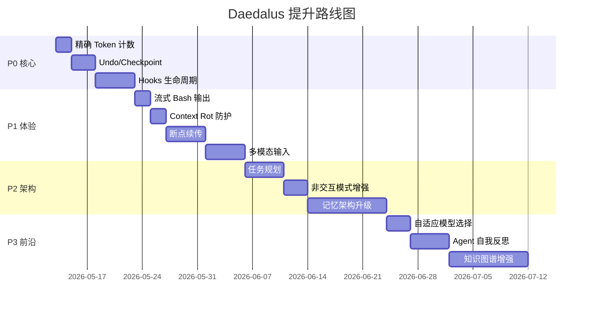

# Daedalus 提升路线图

> **日期**：2026-05-12
> **版本**：v1.0
> **范围**：基于 ~50K 行代码的全面审查，结合 Claude Code 最新特性、2025-2026 业界前沿研究

---

## 目录

- [审查背景](#审查背景)
- [当前架构概览](#当前架构概览)
- [P0：核心能力缺失](#p0核心能力缺失)
  - [1. Hooks 生命周期系统](#1-hooks-生命周期系统)
  - [2. Undo/Checkpoint 机制](#2-undocheckpoint-机制)
  - [3. 精确 Token 计数](#3-精确-token-计数)
- [P1：体验与可靠性提升](#p1体验与可靠性提升)
  - [4. 流式 Bash 输出](#4-流式-bash-输出)
  - [5. 断点续传 / 任务恢复](#5-断点续传--任务恢复)
  - [6. Context Rot 防护](#6-context-rot上下文腐烂防护)
  - [7. 多模态支持](#7-多模态支持图片输入)
- [P2：架构演进](#p2架构演进)
  - [8. 分层记忆架构升级](#8-分层记忆架构升级对齐-lettamemgpt)
  - [9. 任务规划与分解](#9-任务规划与分解planning)
  - [10. 非交互模式增强](#10-非交互模式增强--print--ci-集成)
- [P3：前沿探索](#p3前沿探索)
  - [11. 自适应模型选择](#11-自适应模型选择model-router)
  - [12. Agent 自我反思](#12-agent-自我反思self-reflection)
  - [13. 知识图谱增强记忆](#13-知识图谱增强记忆)
- [总结矩阵](#总结矩阵)
- [建议实施顺序](#建议实施顺序)
- [参考资料](#参考资料)

---

## 审查背景

### 参考基准

| 来源 | 关键特性 | 时间 |
|------|---------|------|
| **Claude Code** | Hooks 8 大事件、`/undo`、SubagentStop、`--dangerously-skip-permissions` | 2025-2026 |
| **Letta/MemGPT** | 虚拟内存分页、Core/Archival Memory、Sleeptime 后台学习 | 2024-2026 |
| **Context Engineering** | 上下文五分类、Context Rot 概念、信息密度监控 | 2025-2026 |
| **Harness Engineering** | File As Progress、任务拆解→并行执行→多层重试 | 2026 |
| **Reflexion/LATS** | Agent 自我反思、失败后经验注入 | 2023-2024 |
| **上下文经济学** | 时间约束决定模型选择、自适应 model routing | 2026 |

### 审查方法

1. 全量代码扫描（190 个 `.rs` 文件，~50K 行）
2. 架构文档交叉验证（`ARCHITECTURE.md`、`docs/design/`）
3. 与 Claude Code 最新版本特性逐项对比
4. 与 2025-2026 学术论文和工程实践对比

---

## 当前架构概览

Daedalus 已具备的核心能力：

```
✅ Trait-based 架构（LlmApi、Memory、BuiltinTool、AgentMode）
✅ 中间件管道（Turn Pipeline + Tool Pipeline，洋葱模型）
✅ 流式输出（SSE 解析，StreamChunk → CLI 实时渲染）
✅ 三策略互斥记忆（sliding_window | dynamic_cheatsheet | agentic）
✅ 6 层上下文压缩体系（tool_history 截断 → compact → context_pressure）
✅ ACP 协议（Agent-to-Agent 通信，Phase 1-3 完整实现）
✅ 子代理系统（SubagentRunner + SubagentRegistry）
✅ 权限确认中间件（ConfirmationToolMiddleware）
✅ 工具并行执行（futures::future::join_all）
✅ 重复调用检测（DuplicateDetector，3 轮警告 / 5 轮终止）
✅ LLM 重试机制（指数退避，429/5xx 自动重试 3 次）
✅ 原子文件写入（write-to-temp-then-rename）
✅ 编辑工具 diff 输出（unified-diff 风格 + 行号报告）
```

---

## P0：核心能力缺失

### 1. Hooks 生命周期系统

#### 现状分析

Daedalus 有 `ToolMiddleware` 管道（`src/middleware/`），支持 Turn 级和 Tool 级中间件。权限确认通过硬编码的 `ConfirmationToolMiddleware`（`src/middleware/builtin/confirmation.rs`）实现。

**问题**：用户无法自定义工具调用前后的行为（如自动格式化、自定义审批逻辑、日志记录）。

#### Claude Code 参考

Claude Code 已实现 **8 大事件**的 Hooks 系统，通过 JSON 配置声明：

| 事件 | 触发时机 | 能否阻断 | 典型用途 |
|------|---------|---------|---------|
| `SessionStart` | 会话新建/恢复 | ❌ | 初始化环境 |
| `UserPromptSubmit` | 用户按回车前 | ✅ | 危险指令过滤 |
| `PreToolUse` | 工具准备执行前 | ✅ | 权限/审计 |
| `PostToolUse` | 工具执行结束 | ❌ | 自动格式化 |
| `Notification` | 需要用户输入 | ❌ | 桌面/Slack 通知 |
| `Stop` | 回答整体结束 | ❌ | 汇总日志 |
| `SubagentStop` | 子代理任务结束 | ❌ | 子任务统计 |
| `PreCompact` | 压缩对话缓存前 | ❌ | 备份历史 |

配置格式：

```json
{
  "hooks": {
    "PreToolUse": [
      {
        "matcher": "Bash",
        "hooks": [
          {
            "type": "command",
            "command": "echo \"Tool: $TOOL_NAME, Input: $TOOL_INPUT\" >> ~/.daedalus/audit.log"
          }
        ]
      }
    ],
    "PostToolUse": [
      {
        "matcher": "edit_file|write_file",
        "hooks": [
          {
            "type": "command",
            "command": "jq -r '.tool_input.path' | xargs prettier --write 2>/dev/null || true"
          }
        ]
      }
    ]
  }
}
```

#### 实现方案

```
src/hooks/
├── mod.rs          # HookEvent 枚举、HookConfig 结构体
├── config.rs       # 从 settings.json 加载 hooks 配置
├── executor.rs     # Shell 命令执行器（带超时和环境变量注入）
└── middleware.rs    # HooksToolMiddleware（集成到 Tool Pipeline）
```

**关键设计**：

1. **配置层**：在 `settings.json`（全局 `~/.daedalus/settings.json` + 项目级 `.daedalus/settings.local.json`）中支持 `hooks` 字段
2. **事件匹配**：`matcher` 字段支持正则匹配工具名
3. **环境变量注入**：将 `tool_name`、`tool_input`、`tool_output` 通过环境变量传递给 shell 命令
4. **阻断能力**：`PreToolUse` 和 `UserPromptSubmit` 的 hook 如果返回非零退出码，则阻断执行
5. **超时保护**：每个 hook 命令有 30 秒超时，防止阻塞 agent 流程

**与现有中间件的关系**：

```
Tool Pipeline:
  [EventMiddleware] → [HooksMiddleware(Pre)] → [ConfirmationMiddleware] → [TracingMiddleware] → Core → [HooksMiddleware(Post)] → ...
```

`HooksToolMiddleware` 作为新的中间件层插入管道，`PreToolUse` 在 `ConfirmationMiddleware` 之前执行（先过 hooks 审计，再过权限确认）。

#### 预估工作量

3-5 天

---

### 2. Undo/Checkpoint 机制

#### 现状分析

Daedalus 的 `edit_file`（`src/tools/edit_file.rs`）和 `multi_edit`（`src/tools/multi_edit.rs`）修改文件后无法撤回。虽然有 `MODIFIED_FILES` 全局集合追踪修改过的文件，但没有保存修改前的内容。

**问题**：LLM 的编辑可能引入 bug，用户需要手动 `git checkout` 恢复，体验差且容易遗漏。

#### Claude Code 参考

Claude Code 支持 `/undo` 命令，基于 git 快照实现文件级回滚：
- 每次工具调用前自动创建 git stash 或内部快照
- `/undo` 回滚最近一次文件修改
- 支持回滚到指定轮次

#### 学术参考

Harness Engineering（2026）提出 **"File As Progress"** 模式：
- 每个文件修改都记录 checkpoint
- 支持断点续传和部分回滚
- 用文件系统本身作为进度追踪器

#### 实现方案

```
src/tools/checkpoint.rs    # Checkpoint 管理器
src/cli/commands/undo.rs   # /undo 斜杠命令
```

**方案 A：Git-based（推荐）**

```rust
/// Checkpoint manager using git stash for file snapshots.
pub struct CheckpointManager {
    /// Stack of checkpoints, newest first.
    checkpoints: Vec<Checkpoint>,
}

struct Checkpoint {
    /// Unique checkpoint ID.
    id: String,
    /// Files modified in this round.
    files: Vec<PathBuf>,
    /// Git stash reference (if using git-based approach).
    stash_ref: Option<String>,
    /// Timestamp.
    created_at: chrono::DateTime<chrono::Utc>,
    /// Human-readable description (e.g., "edit_file src/main.rs").
    description: String,
}
```

**流程**：

```
edit_file 调用前:
  1. 检查文件是否在 git 仓库中
  2. 如果是，执行 `git stash push -m "daedalus-checkpoint-{id}" -- {file}`
  3. 记录 Checkpoint 到内存栈

/undo 命令:
  1. 弹出最近的 Checkpoint
  2. 执行 `git stash pop` 或 `git checkout -- {files}`
  3. 通知用户已回滚的文件列表
```

**方案 B：内存快照（无 git 依赖）**

```rust
struct Checkpoint {
    id: String,
    /// file_path → original_content
    snapshots: HashMap<PathBuf, String>,
    description: String,
}
```

在 `edit_file` 执行前读取文件内容到内存，`/undo` 时直接写回。

**推荐方案 A**，因为：
- 大多数代码项目都在 git 仓库中
- git stash 是原子操作，不会出现部分回滚
- 不占用额外内存

#### 集成点

- `ConfirmationToolMiddleware` 或新的 `CheckpointMiddleware` 在写操作前自动创建 checkpoint
- REPL 层注册 `/undo` 斜杠命令
- `MODIFIED_FILES` 集合已经追踪了修改过的文件，可以复用

#### 预估工作量

2-3 天

---

### 3. 精确 Token 计数

#### 现状分析

当前使用 `chars / 4` 的启发式估算（`src/agent/tool_loop/context_pressure.rs`）：

```rust
// Approximate token count: ~4 chars per token for English text
fn estimate_tokens(text: &str) -> usize {
    text.len() / 4
}
```

**问题**：
- CJK 文本（中文、日文、韩文）每个字符通常是 1-2 个 token，误差可达 **50-100%**
- 代码中的特殊符号（`{}`、`()`、`//`）tokenization 不规则
- compact 触发时机不准确：可能过早触发（浪费上下文）或过晚触发（超出限制）

#### 业界参考

- **Claude Code**：使用精确的 tokenizer（Anthropic tokenizer）
- **OpenAI**：提供 `tiktoken` 库，支持 `cl100k_base`（GPT-4）和 `o200k_base`（GPT-4o）编码
- **Context Engineering 实战（2026）**：强调"上下文预算的精确性直接决定 compact 触发时机的准确性"

#### 实现方案

**分层策略**：

| 层级 | 方法 | 精度 | 性能 |
|------|------|------|------|
| System Prompt | 精确计数 + 缓存 | 100% | 一次性开销 |
| 用户消息 | 精确计数 | 100% | 每轮一次 |
| Tool History | 启发式（改进版） | ~90% | 实时 |
| 总量估算 | 精确 + 启发式混合 | ~95% | 低开销 |

**改进的启发式**：

```rust
fn estimate_tokens_improved(text: &str) -> usize {
    let mut count = 0;
    for ch in text.chars() {
        if ch.is_ascii() {
            count += 1; // ASCII characters: ~4 chars per token
        } else {
            count += 3; // CJK/Unicode: ~1-2 chars per token, use 3 to be safe
        }
    }
    count / 4 + 1
}
```

**精确方案（推荐）**：

```toml
# Cargo.toml
[dependencies]
tiktoken-rs = "0.6"
```

```rust
use tiktoken_rs::cl100k_base;

fn count_tokens_exact(text: &str, model: &str) -> usize {
    let bpe = match model {
        m if m.contains("gpt-4o") => tiktoken_rs::o200k_base().unwrap(),
        _ => tiktoken_rs::cl100k_base().unwrap(),
    };
    bpe.encode_with_special_tokens(text).len()
}
```

对于 Anthropic 模型，可以使用 Anthropic 的 token counting API：
```
POST /v1/messages/count_tokens
```

#### 预估工作量

1-2 天

---

## P1：体验与可靠性提升

### 4. 流式 Bash 输出

#### 现状分析

当前 `bash` 工具（`src/tools/bash.rs`）使用 `tokio::process::Command` 执行命令，等待命令完成后一次性返回 stdout + stderr。

**问题**：长时间运行的命令（如 `cargo build`、`npm install`）在执行期间用户看不到任何输出，只有 spinner 在转。

#### Claude Code 参考

Claude Code 的 bash 工具实时流式输出 stdout/stderr，用户可以看到编译进度、测试结果等。

#### 实现方案

```rust
// src/tools/bash.rs — 改造为流式输出

use tokio::process::Command;
use tokio::io::{AsyncBufReadExt, BufReader};

async fn execute_streaming(
    cmd: &str,
    on_output: &dyn Fn(String),  // 实时输出回调
    timeout: Duration,
) -> Result<(String, i32)> {
    let mut child = Command::new("sh")
        .arg("-c")
        .arg(cmd)
        .stdout(std::process::Stdio::piped())
        .stderr(std::process::Stdio::piped())
        .spawn()?;

    let stdout = child.stdout.take().unwrap();
    let stderr = child.stderr.take().unwrap();

    let mut stdout_reader = BufReader::new(stdout).lines();
    let mut stderr_reader = BufReader::new(stderr).lines();

    let mut output = String::new();

    loop {
        tokio::select! {
            line = stdout_reader.next_line() => {
                match line? {
                    Some(line) => {
                        on_output(line.clone());
                        output.push_str(&line);
                        output.push('\n');
                    }
                    None => break,
                }
            }
            line = stderr_reader.next_line() => {
                if let Ok(Some(line)) = line {
                    on_output(format!("[stderr] {}", line));
                    output.push_str(&line);
                    output.push('\n');
                }
            }
        }
    }

    let status = child.wait().await?;
    Ok((output, status.code().unwrap_or(-1)))
}
```

**集成方式**：通过 `ToolEvent::StreamText` 事件将 bash 输出实时推送到终端。需要在 `BuiltinTool` trait 中增加可选的 streaming 支持，或通过 `Extensions` 传递回调。

#### 预估工作量

1-2 天

---

### 5. 断点续传 / 任务恢复

#### 现状分析

进程崩溃后，虽然 `session_messages.json` 被持久化了，但 `tool_loop` 的中间状态（当前轮次、工具调用历史 `tool_history`）丢失。用户需要重新描述任务。

#### 学术参考

- **Harness Engineering（2026）**：
  - "File As Progress" 模式——用文件系统记录任务进度
  - 每个子任务完成后写入进度文件，崩溃后从最近的进度点恢复
  - 多层重试：单工具重试 → 轮次重试 → 任务重试

- **Letta/MemGPT**：
  - "Agent 睡眠时的后台学习（Sleeptime）"——agent 空闲时整理记忆
  - 状态完全持久化到数据库，支持无限期运行

#### 实现方案

```
.daedalus/checkpoints/
├── turn-{session_id}-{round}.json    # 每 N 轮自动保存
└── latest.json                        # 指向最新 checkpoint
```

**Checkpoint 内容**：

```json
{
  "session_id": "abc123",
  "round": 15,
  "tool_history": [...],
  "total_usage": { "prompt_tokens": 50000, "completion_tokens": 10000 },
  "timestamp": "2026-05-12T19:00:00Z",
  "user_task_summary": "Implementing hooks system for Daedalus"
}
```

**恢复流程**：

```
/resume 命令:
  1. 读取 latest.json
  2. 将 tool_history 注入 tool_loop 的初始状态
  3. 向 LLM 发送恢复提示："You were working on: {task_summary}. You completed {round} rounds. Continue from where you left off."
  4. 继续 tool_loop
```

#### 预估工作量

3-5 天

---

### 6. Context Rot（上下文腐烂）防护

#### 现状分析

Daedalus 有 6 层压缩体系，但缺少对"上下文质量"的主动监控。随着对话轮次增加，上下文中充满了过时的工具摘要、已解决的问题描述、不再相关的代码片段。

#### 学术参考

**Context Engineering（2026）** 提出 "Context Rot" 概念：

> 一个 coding agent 在第 5 分钟和第 35 分钟的行为质量差异巨大。不是因为模型变差了，而是因为上下文中充满了过时信息，稀释了关键信息的注意力权重。

**核心指标**：
- **信息密度**：有效信息 / 总 token 数
- **新鲜度**：最近 N 轮的信息占比
- **相关性**：与当前任务相关的信息占比

#### 实现方案

**1. 上下文健康度监控**

在 `inject_session_metadata`（`src/agent/tool_loop/mod.rs`）中增加健康度指标：

```rust
struct ContextHealth {
    /// Percentage of context occupied by tool history summaries.
    tool_history_pct: f32,
    /// Number of rounds since last compact.
    rounds_since_compact: usize,
    /// Estimated "staleness" — ratio of old (>10 rounds ago) content.
    staleness_ratio: f32,
}
```

**2. 主动 Compact 建议**

当检测到以下条件时，在 LLM 的系统消息中注入提示：

```
⚠️ Context health warning:
- Tool history occupies 45% of context (threshold: 30%)
- 23 rounds since last compact
- Recommendation: Consider running /compact to refresh context
```

**3. 增强 Compact Prompt**

在 compact prompt 中增加指令：

```
When summarizing, prioritize:
1. DISCARD information about resolved issues and completed tasks
2. KEEP current task goals and unresolved problems
3. KEEP recent code changes and their rationale
4. COMPRESS old tool call details into one-line summaries
```

#### 预估工作量

1-2 天

---

### 7. 多模态支持（图片输入）

#### 现状分析

`ChatMessage`（`src/llm/types.rs`）只支持文本 content：

```rust
pub struct ChatMessage {
    pub role: String,
    pub content: String,
    // ...
}
```

**问题**：无法处理截图、UI 设计稿、错误截图等视觉信息。

#### Claude Code 参考

Claude Code 支持图片输入，用户可以粘贴截图或指定图片路径。

#### 实现方案

**1. 扩展 ChatMessage**

```rust
#[derive(Debug, Clone, Serialize, Deserialize)]
pub enum ContentPart {
    Text { text: String },
    Image {
        source: ImageSource,
        #[serde(skip_serializing_if = "Option::is_none")]
        detail: Option<String>,  // "auto" | "low" | "high"
    },
}

#[derive(Debug, Clone, Serialize, Deserialize)]
pub enum ImageSource {
    Base64 { media_type: String, data: String },
    Url { url: String },
}

pub struct ChatMessage {
    pub role: String,
    /// Simple text content (backward compatible).
    pub content: String,
    /// Rich content parts (text + images). If non-empty, takes precedence over `content`.
    #[serde(default, skip_serializing_if = "Vec::is_empty")]
    pub content_parts: Vec<ContentPart>,
}
```

**2. Adapter 层支持**

- **Anthropic**：原生支持 `content` 数组中的 `image` block
- **OpenAI**：支持 `content` 数组中的 `image_url` block
- **Gemini**：支持 `inlineData` 格式

**3. CLI 层**

- 添加 `/image <path>` 斜杠命令
- 支持从剪贴板粘贴图片（需要平台特定实现）

#### 预估工作量

3-5 天

---

## P2：架构演进

### 8. 分层记忆架构升级（对齐 Letta/MemGPT）

#### 现状分析

Daedalus 的记忆系统：

```
SlidingWindowMemory
├── LongTermMemory (JSON)        — 结构化 sections（user_preferences, project_context, ...）
├── HistoryLog (JSONL)           — 追加写入的对话历史
└── consolidation                — 每 N 轮自动提取洞察到 LongTermMemory

DynamicCheatsheet
├── reflect_on_turn              — 每轮提取可复用洞察
└── cheatsheet entries           — 按相关性排序注入上下文

AgenticMemory (A-MEM)
├── MemPalace                    — 向量数据库 + 知识图谱
└── embedding-based retrieval    — 语义检索相关记忆
```

**问题**：三种策略互斥，不能组合使用。LongTermMemory 只能通过 consolidation 自动更新，LLM 不能主动读写。

#### Letta/MemGPT 参考

Letta 的记忆架构：

```
Core Memory (主上下文)
├── persona block      — agent 身份和行为规则
├── human block        — 用户信息和偏好
└── custom blocks      — 可扩展的记忆块

Archival Memory (外存)
├── 向量数据库          — 语义检索
└── 无限容量            — 历史对话、文档、知识

Memory Tools (记忆工具)
├── core_memory_append    — 向主上下文追加信息
├── core_memory_replace   — 替换主上下文中的信息
├── archival_memory_insert — 存入外存
└── archival_memory_search — 从外存检索

Memory Paging (分页调度)
├── 主上下文满时自动换出到外存
└── 需要时从外存换入到主上下文

Sleeptime (后台学习)
├── agent 空闲时整理记忆
└── 合并重复信息、更新过时信息
```

#### 实现方案

**Phase 1：LLM 可主动操作记忆**

给 LLM 提供 `update_memory` 和 `search_memory` 工具：

```rust
// src/tools/memory_tool.rs

pub struct UpdateMemoryTool { /* ... */ }
pub struct SearchMemoryTool { /* ... */ }

// update_memory: 让 LLM 主动更新 LongTermMemory 的 sections
// search_memory: 让 LLM 从 HistoryLog 或 MemPalace 中检索信息
```

**Phase 2：记忆分页**

当 LongTermMemory 超过阈值时，将低频 section 换出到 HistoryLog：

```rust
impl SlidingWindowMemory {
    fn page_out_stale_sections(&mut self) {
        let sections = self.long_term.sections();
        for section in sections {
            if section.last_accessed_round < self.current_round - 20 {
                self.history_log.archive_section(section);
                self.long_term.remove_section(section.key);
            }
        }
    }
}
```

**Phase 3：策略组合**

允许 SlidingWindow + AgenticMemory 组合使用：
- SlidingWindow 管理短期对话历史
- AgenticMemory 作为长期外存
- consolidation 同时更新两者

#### 预估工作量

5-10 天

---

### 9. 任务规划与分解（Planning）

#### 现状分析

LLM 自主决定工具调用顺序，没有显式的任务规划层。对于复杂任务（如"重构整个模块"），LLM 可能在中途迷失方向。

#### 学术参考

- **Harness Engineering（2026）**：对长程任务需要"任务拆解 → 并行执行 → 多层重试"
- **Context Engineering（2026）**：将上下文分为 5 类，其中"任务上下文"需要显式管理

#### 实现方案

**Plan 模式**：

```
用户: "重构 memory 模块，将三种策略改为可组合的"

LLM 生成计划:
┌─────────────────────────────────────────────┐
│ Plan: Refactor Memory Module                │
│                                             │
│ 1. ⏳ Analyze current Memory trait interface │
│ 2. ⏳ Design composable memory architecture  │
│ 3. ⏳ Implement base SlidingWindow layer     │
│ 4. ⏳ Implement optional AgenticMemory layer │
│ 5. ⏳ Update configuration schema            │
│ 6. ⏳ Migrate existing tests                 │
│ 7. ⏳ Update documentation                   │
└─────────────────────────────────────────────┘

用户确认后，逐步执行，每步完成后更新状态:
│ 1. ✅ Analyze current Memory trait interface │
│ 2. ✅ Design composable memory architecture  │
│ 3. 🔄 Implement base SlidingWindow layer     │  ← 当前步骤
│ 4. ⏳ Implement optional AgenticMemory layer │
```

**实现要点**：

1. 计划作为 "preserved" 消息注入上下文，不被 compact 压缩
2. 每步完成后更新计划状态（✅/❌/⏳/🔄）
3. 支持 `/plan` 斜杠命令查看当前计划
4. 支持 `/skip` 跳过当前步骤

#### 预估工作量

3-5 天

---

### 10. 非交互模式增强（`--print` / CI 集成）

#### 现状分析

有 `--print` 模式，但权限确认在非交互模式下直接拒绝写操作。

#### Claude Code 参考

Claude Code 支持：
- `--dangerously-skip-permissions` + `--print` 组合用于 CI/CD
- JSON 输出格式
- stdin 输入

#### 实现方案

```bash
# CI/CD 用法示例
echo "Fix the failing test in src/tools/edit_file.rs" | \
  daedalus --print --auto-approve --output-format json

# 输出:
{
  "response": "Fixed the test by...",
  "files_modified": ["src/tools/edit_file.rs"],
  "tool_calls": 5,
  "tokens_used": { "prompt": 15000, "completion": 3000 },
  "exit_code": 0
}
```

**新增 CLI 参数**：

| 参数 | 说明 |
|------|------|
| `--auto-approve` | 自动批准所有工具调用（替代 `--dangerously-skip-permissions`） |
| `--output-format <json\|text>` | 输出格式 |
| `--max-rounds <N>` | 最大工具调用轮次 |
| `--timeout <seconds>` | 总超时时间 |

#### 预估工作量

2-3 天

---

## P3：前沿探索

### 11. 自适应模型选择（Model Router）

#### 现状分析

主 agent 使用固定模型（`config.yaml` 中配置），只有 subagent 支持 `model_class: fast | default | strong` 切换。

#### 学术参考

**上下文经济学（2026）**：

> 2026 年编程 Agent 的选型核心不是"哪个模型最强"，而是你的时间约束决定模型选择。

| 场景 | 推荐模型 | 原因 |
|------|---------|------|
| 简单文件读取/搜索 | fast（Haiku） | 低延迟、低成本 |
| 代码编辑/重构 | default（Sonnet） | 平衡质量和速度 |
| 复杂架构决策 | strong（Opus） | 最高推理能力 |
| 连续失败后升级 | strong | 错误恢复 |

#### 实现方案

```rust
// src/agent/model_router.rs

pub struct ModelRouter {
    fast: LlmConfig,
    default: LlmConfig,
    strong: LlmConfig,
}

impl ModelRouter {
    /// Select model based on task complexity signals.
    pub fn select(&self, signals: &TaskSignals) -> &LlmConfig {
        if signals.consecutive_failures >= 3 {
            return &self.strong;  // Escalate on repeated failures
        }
        if signals.is_simple_query {
            return &self.fast;
        }
        &self.default
    }
}

pub struct TaskSignals {
    pub consecutive_failures: usize,
    pub tool_calls_in_round: usize,
    pub is_simple_query: bool,
    pub estimated_complexity: Complexity,
}
```

#### 预估工作量

2-3 天

---

### 12. Agent 自我反思（Self-Reflection）

#### 现状分析

有 `reflect_on_turn`（DynamicCheatsheet），但只提取可复用洞察，不做错误反思。

#### 学术参考

- **Reflexion（2023）**：agent 在失败后进行自我反思，将反思结果注入下一次尝试
- **LATS（2024）**：Language Agent Tree Search——将反思与搜索结合，探索多条解决路径

#### 实现方案

**触发条件**：
- 工具调用连续失败 3 次
- 用户明确拒绝 LLM 的编辑
- compact 后 LLM 行为质量下降

**反思流程**：

```
1. 收集失败上下文（工具名、参数、错误信息）
2. 调用 LLM（可以用 fast 模型）生成反思：
   "What went wrong? What should I do differently?"
3. 将反思结果注入 LongTermMemory 的 "Important Notes" section
4. 在下一次 tool_loop 迭代中，LLM 可以看到反思结果
```

**示例反思输出**：

```
[Reflection] Failed to edit src/main.rs 3 times:
- Root cause: The old_string contained incorrect indentation (tabs vs spaces)
- Lesson: Always read the file first to verify exact whitespace before editing
- Action: Use read_file before edit_file for unfamiliar files
```

#### 预估工作量

3-5 天

---

### 13. 知识图谱增强记忆

#### 现状分析

有 Agentic Memory（A-MEM）策略，包含 `MemPalace`（向量数据库 + 知识图谱），但与主流的 SlidingWindow 策略互斥。

#### 实现方案

将知识图谱作为 SlidingWindowMemory 的**可选增强层**：

```
SlidingWindowMemory
├── LongTermMemory          — 结构化 sections
├── HistoryLog              — 对话历史
├── consolidation           — 自动提取洞察
└── [Optional] KnowledgeGraph  — 实体关系图
    ├── 在 consolidation 时自动提取实体关系
    ├── 在 build_messages 时根据当前话题检索相关实体
    └── 持久化到 .daedalus/knowledge_graph.json
```

**实体提取示例**：

```
对话: "我在 src/tools/edit_file.rs 中添加了 undo 功能"

提取实体:
  - Entity: "edit_file.rs" (type: file, path: src/tools/edit_file.rs)
  - Entity: "undo" (type: feature)
  - Relation: "edit_file.rs" --contains--> "undo"
  - Relation: "undo" --implemented_in--> "edit_file.rs"
```

#### 预估工作量

5-10 天

---

## 总结矩阵

| 优先级 | # | 方向 | 预估工作量 | 参考来源 | 影响面 |
|--------|---|------|-----------|---------|--------|
| 🔴 P0 | 1 | Hooks 生命周期 | 3-5 天 | Claude Code Hooks | 可扩展性 |
| 🔴 P0 | 2 | Undo/Checkpoint | 2-3 天 | Claude Code `/undo` | 用户安全感 |
| 🔴 P0 | 3 | 精确 Token 计数 | 1-2 天 | 业界共识 | compact 准确性 |
| 🟡 P1 | 4 | 流式 Bash 输出 | 1-2 天 | Claude Code | 交互体验 |
| 🟡 P1 | 5 | 断点续传 | 3-5 天 | Harness Engineering | 长任务可靠性 |
| 🟡 P1 | 6 | Context Rot 防护 | 1-2 天 | Context Engineering | 输出质量 |
| 🟡 P1 | 7 | 多模态输入 | 3-5 天 | Claude Code | 能力扩展 |
| 🟢 P2 | 8 | 记忆架构升级 | 5-10 天 | Letta/MemGPT | 长期记忆 |
| 🟢 P2 | 9 | 任务规划 | 3-5 天 | Harness Engineering | 复杂任务 |
| 🟢 P2 | 10 | 非交互模式增强 | 2-3 天 | Claude Code CI | 自动化 |
| 🔵 P3 | 11 | 自适应模型选择 | 2-3 天 | 上下文经济学 | 成本优化 |
| 🔵 P3 | 12 | Agent 自我反思 | 3-5 天 | Reflexion/LATS | 错误恢复 |
| 🔵 P3 | 13 | 知识图谱增强 | 5-10 天 | A-MEM | 深度记忆 |

**总计**：~40-70 人天

---

## 建议实施顺序



**推荐的前 5 步**：

1. **精确 Token 计数**（1-2 天）— 基础设施，影响所有上下文管理决策
2. **Undo/Checkpoint**（2-3 天）— 用户安全感，降低使用门槛
3. **Hooks 生命周期**（3-5 天）— 可扩展性，解锁用户自定义能力
4. **流式 Bash 输出**（1-2 天）— 交互体验，低成本高收益
5. **Context Rot 防护**（1-2 天）— 输出质量，低成本高收益

---

## 参考资料

### Claude Code

- [Claude Code Hooks 官方文档](https://docs.anthropic.com/en/docs/claude-code/hooks)
- Claude Code 8 大事件：SessionStart, UserPromptSubmit, PreToolUse, PostToolUse, Notification, Stop, SubagentStop, PreCompact

### 学术论文

- **MemGPT/Letta**: Packer et al., "MemGPT: Towards LLMs as Operating Systems", 2023
- **Reflexion**: Shinn et al., "Reflexion: Language Agents with Verbal Reinforcement Learning", NeurIPS 2023
- **LATS**: Zhou et al., "Language Agent Tree Search Unifies Reasoning Acting and Planning in Language Models", ICML 2024

### 工程实践

- **Context Engineering 实战 2026**: 上下文五分类（系统/任务/对话/知识/状态）
- **Harness Engineering 2026**: File As Progress、任务拆解→并行执行→多层重试
- **上下文经济学 2026**: 时间约束决定模型选择、自适应 model routing
- **Letta Sleeptime**: Agent 空闲时后台整理记忆、Git 版本化记忆协同
