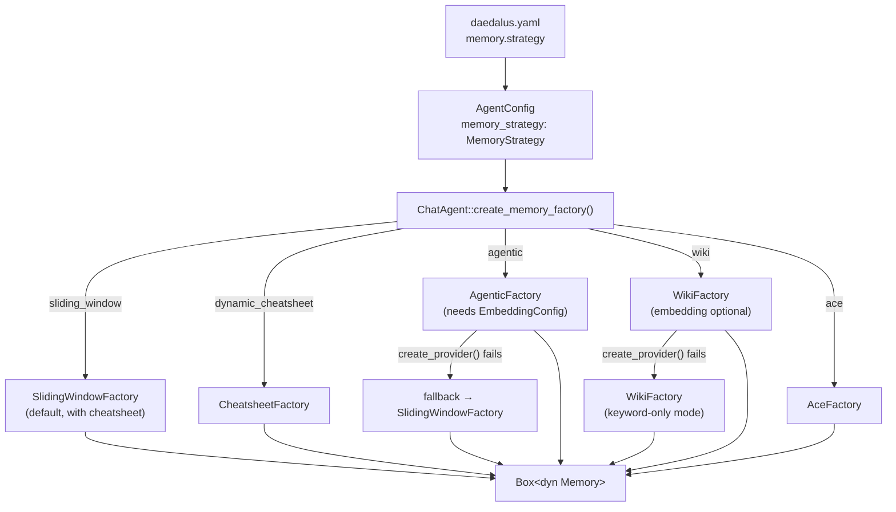
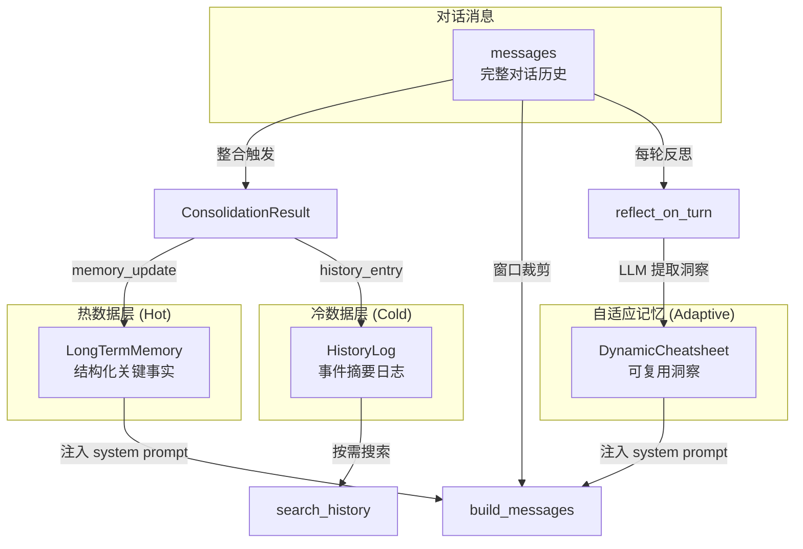
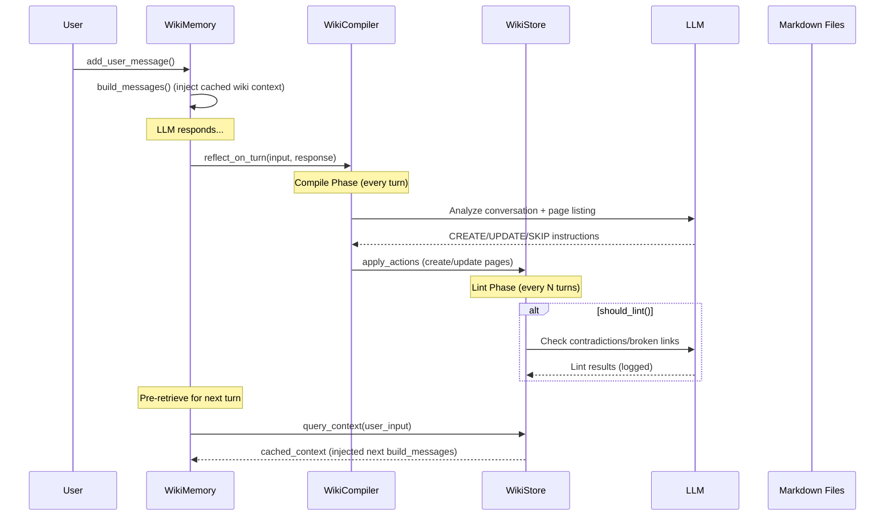
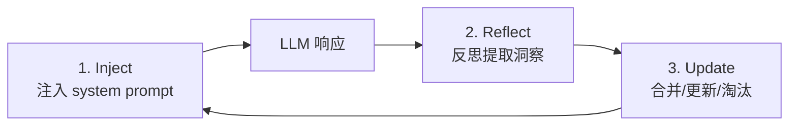
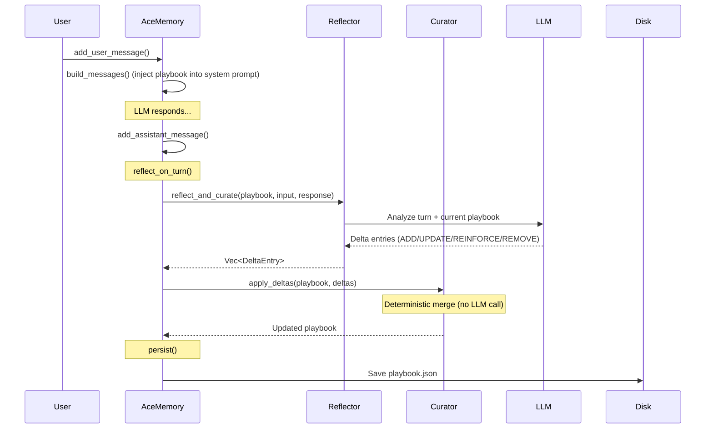

# Memory — 五策略互斥记忆系统

> 最后更新：2026-04-16
> 来源：存量代码分析 + 记忆系统重构 + 代码质量审查 + A-MEM 实现 + Workspace 持久化优化 + Dynamic Cheatsheet 实现 + 三策略互斥架构 + Wiki Memory 实现 + **ACE Memory 实现**

## 1. 模块概述

Memory 模块定义了会话记忆的统一接口（`Memory` trait）和五种**互斥**的记忆策略，用户通过 YAML 配置选择：

- **`SlidingWindowMemory`**（默认）：双层记忆架构，热数据层 + 冷数据层 + 滑动窗口 + 自动整合 + 可选 Dynamic Cheatsheet
- **`CheatsheetMemory`**：独立的 Dynamic Cheatsheet 策略，轻量级自适应记忆，每轮对话后 LLM 反思提取可复用洞察
- **`AgenticMemory`**：独立的 A-MEM 知识图谱策略，embedding 向量检索 + 记忆演化 + 上下文预缓存
- **`WikiMemory`**：LLM Wiki 策略（Karpathy 模式），将对话知识编译为结构化 Markdown Wiki，支持 wikilinks 互联 + 可选 embedding 检索
- **`AceMemory`**：ACE（Agentic Context Engineering）策略，层次化 Playbook（Section→Bullet），LLM 产出增量 delta entries + 确定性 Curator 合并，防止上下文坍塌

### 策略选择配置

```yaml
# daedalus.yaml
memory:
  strategy: sliding_window  # sliding_window | dynamic_cheatsheet | agentic | wiki | ace

# Embedding provider (top-level, used by agentic and wiki strategies)
embedding:
  api_key: "sk-..."          # Falls back to OPENAI_API_KEY env var
  api_base: "https://..."    # Falls back to OPENAI_BASE_URL env var
  model: "text-embedding-3-small"
  dimensions: 1536
```

### 策略选择流程



**关键设计决策**：
- 五种策略完全互斥，每个都是独立的 `Memory` 实现
- `MemoryStrategy` 枚举定义在 `config/agent_config.rs`，通过 `#[serde(rename_all = "snake_case")]` 支持 YAML
- `EmbeddingConfig` 作为**顶层** YAML section（独立于 memory），因为 embedding provider 未来可能被多个功能共享
- Agentic 策略在 embedding provider 创建失败时**优雅降级**到 `sliding_window`
- Wiki 策略在 embedding provider 创建失败时**优雅降级**到 keyword-only 模式（不降级到其他策略）
- ACE 策略不需要 embedding，是纯 LLM 反思策略
- 不配置 `memory.strategy` 时默认 `sliding_window`，向后兼容

此外，`src/embedding/` 模块提供了 `Embedding` trait 抽象和 OpenAI 实现，为 A-MEM 和 Wiki Memory 的向量检索提供基础设施。

## 2. Memory Trait

> 📍 **代码位置**：`src/memory/mod.rs`

```rust
pub trait Memory: Send + Sync {
    fn add_user_message(&mut self, content: &str);
    fn add_assistant_message(&mut self, content: &str);
    fn add_tool_context(&mut self, context: &str) { self.add_assistant_message(context); }
    fn build_messages(&self) -> Vec<ChatMessage>;
    fn clear(&mut self);
    fn should_consolidate(&self) -> bool { false }
    fn turn_count(&self) -> usize;
    fn strategy_name(&self) -> &str;
    fn take_persistent_state(&mut self) -> Option<PersistentState> { None }
    fn restore_persistent_state(&mut self, _state: PersistentState) { /* warn + discard */ }
    fn persist(&self, _workspace: &Workspace) -> Result<()> { Ok(()) }
    fn reflect_on_turn(&mut self, user_input: &str, assistant_response: &str, llm: &dyn LlmApi) -> Pin<Box<dyn Future<Output = ()>>>;
    fn as_any(&self) -> &dyn Any;
    fn as_any_mut(&mut self) -> &mut dyn Any;
}
```

**设计要点**：
- `add_tool_context()` 有默认实现（委托给 `add_assistant_message`），区分工具上下文和普通助手消息
- `should_consolidate()` 有默认实现（返回 `false`），不支持整合的策略无需重写
- `persist()` 有默认 no-op 实现，在 shutdown 时调用，无需 downcast 到具体类型即可持久化记忆状态
- `reflect_on_turn()` 在每轮对话后触发反思（默认 no-op），支持 Dynamic Cheatsheet 等自适应记忆模块提取可复用洞察
- `take_persistent_state()` / `restore_persistent_state()` 支持跨 session 迁移
- `as_any()` / `as_any_mut()` 提供 downcast 能力，使 Agent 层可以访问策略特定功能

**`as_any` downcast 设计决策**：

引入 `as_any` 的原因是双层记忆引入了大量策略特定方法（`search_history`、`messages_to_consolidate`、`take_persistent_state` 等），如果全部放入 `Memory` trait 会导致 trait 膨胀，且不支持整合的策略需要提供大量空实现。通过 downcast，基础 trait 保持精简（11 个方法），策略特定功能通过 `as_any_mut().downcast_mut::<SlidingWindowMemory>()` 按需访问。

**权衡**：
- ✅ 基础 trait 不被策略特定方法污染
- ✅ 新增 Memory 实现无需实现不相关的方法
- ⚠️ downcast 失去了编译时类型安全，调用方需要处理 `None` 情况
- ⚠️ 如果未来有第二种支持持久化的 Memory 实现，所有 downcast 点都需要扩展

[置信度：高]

## 3. SlidingWindowMemory — 双层记忆引擎

> 📍 **代码位置**：`src/memory/sliding_window.rs`

### 结构

```
SlidingWindowMemory {
    base_system_prompt: String,       // 原始系统提示词（不含记忆注入）
    messages: Vec<ChatMessage>,       // 完整对话消息历史
    persistent: PersistentComponents, // 聚合持久化组件
    consolidation_cursor: usize,      // 整合游标
    config: SlidingWindowConfig,      // 窗口与整合配置
}

PersistentComponents {
    long_term_memory: LongTermMemory,        // 热数据：结构化关键事实
    history_log: Vec<HistoryEntry>,          // 冷数据：事件摘要日志
    cheatsheet: Option<DynamicCheatsheet>,   // 可选：动态速查表
}
```

**`PersistentComponents` 聚合结构**：将所有跨 session 持久化的组件聚合到一个结构体中，简化 `take_persistent_state()` / `restore_persistent_state()` / `persist()` 的实现——它们都操作同一个结构体，新增持久化组件只需一行改动。

**命名说明**：字段 `messages`（而非 `history`）与 `build_messages()` 和 `windowed_messages()` 语义对齐，避免与 `history_log` 混淆。字段 `consolidation_cursor`（而非 `last_consolidated`）消除了"最后一条已合并"vs"第一条未合并"的歧义——它是一个游标，指向第一条未合并消息的索引。

### 双层数据流



## 4. Agentic Memory (A-MEM) — 知识图谱记忆引擎

> 📍 **代码位置**：`src/memory/agentic/`
> 📄 **论文**：A-MEM (arxiv:2502.12110)
> ✅ **状态**：已集成为独立记忆策略（`memory.strategy: agentic`）

### 设计动机

SlidingWindowMemory 的双层架构解决了"关键事实不丢失"的问题，但它的知识组织是**扁平的**——长期记忆只是分类列表，缺乏知识之间的关联。A-MEM 引入了**知识图谱**的概念：每条记忆是一个带有丰富元数据的节点（MemoryNote），节点之间通过语义相似性建立双向链接，形成可演化的知识网络。

### 三阶段生命周期

A-MEM 的核心是论文中定义的三阶段记忆生命周期：


1. **Note Construction**：原始内容 → LLM 提取 keywords/tags/context → Embedding 模型生成向量 → 创建 `MemoryNote`
2. **Link Generation**：余弦相似度检索候选节点 → LLM 验证语义关联 → 建立双向链接
3. **Memory Evolution**：新链接建立后 → LLM 重新分析关联节点的元数据 → 更新 keywords/tags/context 以反映高阶知识模式

### 模块结构

```
src/memory/agentic/
├── mod.rs          # 模块入口，re-export
├── note.rs         # MemoryNote — 原子知识单元（Zettelkasten 风格）
├── store.rs        # AgenticMemoryStore — 三阶段引擎 + 检索
├── memory.rs       # AgenticMemory — 独立 Memory trait 实现
└── factory.rs      # AgenticFactory — MemoryFactory 实现
src/embedding/
├── mod.rs          # Embedding trait + cosine_similarity()
└── openai.rs       # OpenAI text-embedding-3-small 实现
```

### MemoryNote 结构

每个 note 是一个自包含的知识单元：

| 字段 | 类型 | 说明 |
|------|------|------|
| `id` | `Uuid` | 唯一标识 |
| `content` | `String` | 原始内容 |
| `keywords` | `Vec<String>` | LLM 提取的关键词 |
| `tags` | `Vec<String>` | LLM 提取的分类标签 |
| `context` | `String` | LLM 生成的语义描述 |
| `embedding` | `Vec<f32>` | 向量表示（用于相似度检索） |
| `linked_notes` | `HashSet<Uuid>` | 双向链接（知识图谱边） |
| `created_at` / `updated_at` | `DateTime<Local>` | 时间戳 |

### AgenticMemoryStore 配置常量

| 常量 | 默认值 | 说明 |
|------|--------|------|
| `DEFAULT_SIMILARITY_THRESHOLD` | 0.5 | 链接候选的最低余弦相似度 |
| `DEFAULT_MAX_LINK_CANDIDATES` | 5 | 每次链接生成检索的最大候选数 |
| `DEFAULT_RETRIEVAL_LIMIT` | 5 | 上下文检索返回的最大 note 数 |

### Embedding Trait

> 📍 **代码位置**：`src/embedding/mod.rs`

```rust
#[async_trait]
pub trait Embedding: Send + Sync {
    async fn embed(&self, text: &str) -> Result<Vec<f32>>;
    async fn embed_batch(&self, texts: &[&str]) -> Result<Vec<Vec<f32>>>;
    fn dimensions(&self) -> usize;
    fn model_name(&self) -> &str;
}
```

`embed_batch` 有默认实现（顺序调用 `embed`），支持批量 API 的 Provider 可覆盖以提升性能。`cosine_similarity()` 作为模块级函数提供，用于向量相似度计算。

### Prompt 模板分离

A-MEM 的三个 LLM 交互阶段各有独立的 prompt 模板，从业务逻辑中提取为模块级常量和构造函数：

| 常量/函数 | 用途 |
|-----------|------|
| `METADATA_SYSTEM_PROMPT` | 元数据提取的 system prompt |
| `LINK_VALIDATION_SYSTEM_PROMPT` | 链接验证的 system prompt |
| `EVOLUTION_SYSTEM_PROMPT` | 记忆演化的 system prompt |
| `metadata_extraction_prompt()` | 构造元数据提取的 user prompt |
| `link_validation_prompt()` | 构造链接验证的 user prompt |
| `evolution_prompt()` | 构造记忆演化的 user prompt |

**设计决策**：将 prompt 模板与业务逻辑分离，便于调整措辞、支持多语言或 A/B 测试不同 prompt，无需修改核心引擎代码。

### AgenticMemory — 独立 Memory 实现

> 📍 **代码位置**：`src/memory/agentic/memory.rs`

`AgenticMemory` 是 A-MEM 的独立 `Memory` trait 实现，管理自己的消息列表和 system prompt 注入。

**工作流程**（避免 async-in-sync 死锁）：
1. `add_user_message()` — 纯同步，只追加消息（不做 embedding 检索）
2. `build_messages()` — 注入上一轮预缓存的 `cached_context` 到 system prompt
3. `reflect_on_turn()` — **异步**，执行两步：
   - Step 1: 将 assistant 响应存储为新 memory note（触发 A-MEM 三阶段生命周期）
   - Step 2: 用当前 `user_input` 预检索相关记忆，缓存到 `cached_context` 供**下一轮**使用

**消息窗口**：`max_messages = 100`（`DEFAULT_MAX_MESSAGES`），防止长对话 token 超限。

**`Arc<dyn Embedding>` 设计**：embedding provider 通过 `Arc` 共享，因为 `AgenticFactory` 持有引用并分发 clone 给每个 memory 实例。

### 待完成工作

- [ ] 考虑将 LLM 编排逻辑从 `AgenticMemoryStore` 中拆分（存储 vs 编排职责分离）

[置信度：高]

## 6. Wiki Memory — LLM Wiki 知识编译引擎

> 📍 **代码位置**：`src/memory/wiki/`
> 📄 **灵感来源**：[Karpathy LLM Wiki](https://gist.github.com/karpathy/442a6bf555914893e9891c11519de94f)
> ✅ **状态**：已集成为独立记忆策略（`memory.strategy: wiki`）

### 设计动机

Karpathy 提出的 LLM Wiki 模式是对传统 RAG 的范式升级——从"解释器模式"（查询时临时检索原始文档）到"编译器模式"（预先将知识编译为结构化、互联的 Wiki 页面）。核心差异：

| 维度 | 传统 RAG（解释器模式） | LLM Wiki（编译器模式） |
|------|----------------------|----------------------|
| 知识处理 | 查询时临时检索 | 预先编译为结构化知识 |
| 知识关联 | 向量相似度 | 语义双向链接（wikilinks） |
| 知识累积 | 每次查询消耗不沉淀 | 每次交互持续增值 |
| 矛盾处理 | 无法检测 | 主动标注并解决（Lint） |
| 知识结构 | 扁平文档块 | 层次化互联知识图谱 |

### 三层架构

Wiki Memory 实现了 Karpathy 的三层架构：

- **Raw Layer（原始资料层）**：对话记录、工具调用结果（瞬态，由 WikiMemory 管理）
- **Wiki Layer（知识编译层）**：结构化、互联的 Markdown 页面（持久化为 `.md` 文件）
- **Schema Layer（模式指令层）**：页面结构规则（通过 prompts + YAML frontmatter 约束）

### 核心工作流



1. **Compile**（每轮）：LLM 分析对话，提取实体/概念/事实，创建/更新 Wiki 页面并建立 wikilinks
2. **Query**（每轮）：从 Wiki 中检索相关页面，注入到下一轮的 system prompt
3. **Lint**（每 N 轮）：LLM 自检 Wiki 一致性——检测矛盾、断链、重复、过时内容

### 模块结构

```
src/memory/wiki/
├── mod.rs          # 模块入口，re-export WikiFactory
├── page.rs         # WikiPage, PageFrontmatter, PageType — 数据模型 + YAML frontmatter 序列化
├── meta.rs         # WikiMeta — _meta.json 结构（embeddings, lint state）
├── store.rs        # WikiStore — 核心引擎：CRUD + 持久化 + backlinks + MemoryPersistence impl
├── retriever.rs    # WikiRetriever — 检索策略：embedding 相似度 / 关键词匹配 + wikilink 遍历
├── compiler.rs     # WikiCompiler — LLM 编排：Compile + Lint 工作流 + 响应解析
├── prompts.rs      # LLM prompt 模板（compile + lint）
├── memory.rs       # WikiMemory — Memory trait 实现
└── factory.rs      # WikiFactory — MemoryFactory 实现
```

### 双模式检索（Embedding 可选）

Wiki 策略的核心设计决策是 **embedding 可选**——这是四种策略中唯一不强制依赖 embedding 的知识积累策略：

| 模式 | 触发条件 | 检索方式 | 质量 |
|------|---------|---------|------|
| **Keyword-only** | 未配置 `embedding:` | 关键词匹配（title 3x, tags 2x, id 2x, body 1x）+ 1-hop wikilink 遍历 | 基础 |
| **Embedding+Keywords** | 配置了 `embedding:` | Cosine similarity 向量检索 | 增强 |

```yaml
# 最简配置（keyword-only 模式）
memory:
  strategy: wiki

# 增强配置（embedding 模式）
memory:
  strategy: wiki
embedding:
  api_key: "sk-xxx"
  model: "text-embedding-3-small"
```

### Markdown 持久化（Obsidian 兼容）

每个 Wiki 页面是一个 `.md` 文件 + YAML frontmatter，完全兼容 Obsidian：

```text
memory/wiki/
├── _index.md       # Master index (auto-maintained)
├── _meta.json      # Embeddings + lint state (machine data)
├── rust-ownership.md
└── project-daedalus.md
```

页面格式示例：

```markdown
---
title: Rust Ownership Model
page_type: topic
tags: [rust, memory-safety]
links: [rust-borrowing, project-daedalus]
created_at: "2026-04-16T10:00:00+08:00"
updated_at: "2026-04-16T10:30:00+08:00"
revision_count: 3
---

# Rust Ownership Model

Rust's ownership system is a set of rules...

## Related
- [[rust-borrowing]] — Borrowing rules
```

**设计要点**：
- 人可读数据（frontmatter + body）在 `.md` 文件，机器数据（embedding 向量）在 `_meta.json`
- `_` 前缀文件是系统文件（`_index.md`、`_meta.json`），自动维护
- 文件名即 page ID（slug 格式）
- Backlinks 在加载时从 forward links 计算，不持久化
- 加载时自动清理 `_meta.json` 中的孤立 embedding（用户删除 `.md` 文件后）
- 单页解析失败仅 warn 跳过，不影响其他页面

### 与其他策略的对比

| 维度 | SlidingWindow | DynamicCheatsheet | Agentic (A-MEM) | **Wiki** |
|------|:---:|:---:|:---:|:---:|
| 知识结构 | 热/冷双层 | 扁平条目列表 | 知识图谱（节点+边） | **层次化互联 Wiki** |
| 知识粒度 | 消息级 | 洞察/策略级 | 笔记级 | **页面级（实体/概念/主题）** |
| 知识关联 | 无 | 无 | 向量相似度+LLM验证 | **语义 wikilinks + 可选向量检索** |
| 知识演化 | 整合压缩 | 强化/淘汰 | 元数据进化 | **页面修订 + Lint 自检** |
| Embedding 依赖 | 无 | 无 | **必须** | **可选** |
| 持久化格式 | JSON + JSONL | JSON | JSON | **Markdown + JSON** |
| 人类可编辑 | ❌ | ❌ | ❌ | **✅ Obsidian 兼容** |
| LLM 调用/轮 | 0 | 1 | 3 | **1-2 + 定期 Lint** |
| 适用场景 | 通用对话 | 重复任务 | 长期知识积累 | **深度知识编译 + 跨主题关联** |

### Prompt 模板

| 常量/函数 | 用途 |
|-----------|------|
| `COMPILE_SYSTEM_PROMPT` | 编译的 system prompt |
| `build_compile_prompt()` | 构造编译的 user prompt（含页面列表 + 对话轮次） |
| `LINT_SYSTEM_PROMPT` | Lint 检查的 system prompt |
| `build_lint_prompt()` | 构造 lint 的 user prompt（含所有页面文本） |

### WikiStore 配置常量

| 常量 | 默认值 | 说明 |
|------|--------|------|
| `DEFAULT_LINT_INTERVAL` | 10 | 每 N 轮对话触发一次 Lint |
| `DEFAULT_MAX_RETRIEVAL_PAGES` | 5 | 检索返回的最大页面数 |
| `KEYWORD_MATCH_THRESHOLD` | 0.1 | 关键词匹配的最低分数阈值 |
| `LINK_EXPANSION_SCORE` | 0.3 | wikilink 扩展页面的基础分数 |
| `MAX_SEED_PAGES` | 3 | wikilink 扩展的种子页面数 |

[置信度：高]

## 5. Dynamic Cheatsheet — 自适应记忆模块

> 📍 **代码位置**：`src/memory/dynamic_cheatsheet/`
> 📄 **论文**：[Dynamic Cheatsheet: Test-Time Learning with Adaptive Memory](https://arxiv.org/pdf/2504.07952) (Suzgun et al., 2025)
> ✅ **状态**：可作为 SlidingWindowMemory 的可选组件，也可作为独立记忆策略（`memory.strategy: dynamic_cheatsheet`）

### 设计动机

当前 LLM 在推理时是"无状态"的——每个查询独立处理，不会保留之前尝试中获得的洞察。模型会反复重新发现相同的解题策略，或反复犯同样的错误。Dynamic Cheatsheet（DC）通过在每轮对话后进行 LLM 反思，提取可复用的洞察（策略、错误模式、代码片段等），累积到结构化的速查表中，并在下一次 LLM 调用时注入 system prompt。

### 生命周期



1. **Inject**：`effective_system_prompt()` 将 cheatsheet 渲染为 Markdown 注入 system prompt
2. **Reflect**：`Memory::reflect_on_turn()` 调用 LLM 分析本轮对话，提取新洞察
3. **Update**：`apply_reflection_response()` 解析 LLM 响应，合并新条目、更新已有条目、淘汰低价值条目

### 模块结构

```
src/memory/dynamic_cheatsheet/
├── mod.rs          # 模块入口，re-export
├── entry.rs        # CheatsheetEntry — 单条洞察条目
├── config.rs       # CheatsheetConfig — 容量/淘汰/反思配置
├── cheatsheet.rs   # DynamicCheatsheet — 核心引擎（数据操作 + 共享反思方法）
├── prompts.rs      # LLM prompt 模板（system + user）
├── memory.rs       # CheatsheetMemory — 独立 Memory trait 实现
└── factory.rs      # CheatsheetFactory — MemoryFactory 实现
```

### CheatsheetEntry 结构

| 字段 | 类型 | 说明 |
|------|------|------|
| `category` | `String` | 分类（strategy / error_pattern / code_snippet / best_practice / domain_knowledge） |
| `content` | `String` | 简洁可操作的洞察描述 |
| `reinforcement_count` | `u32` | 被强化（使用/验证）的次数 |
| `created_at` / `updated_at` | `DateTime<Local>` | 时间戳 |

### CheatsheetConfig 配置

| 配置项 | 默认值 | 说明 |
|--------|--------|------|
| `max_entries` | 50 | 最大条目数，超出时触发淘汰 |
| `max_token_budget` | 2000 | 渲染为 Markdown 时的最大 token 预算（~4 chars/token） |
| `auto_reflect` | true | 是否在每轮对话后自动反思 |
| `min_reinforcement_for_retention` | 1 | 淘汰时的最低强化次数阈值 |

### 淘汰策略（两阶段）

当条目数超过 `max_entries` 时触发淘汰：

1. **Phase 1**：优先淘汰 `reinforcement_count < min_reinforcement_for_retention` 的条目
2. **Phase 2**：如果仍超容量，按 `reinforcement_count ASC, updated_at ASC` 排序，从前端移除

### 反思协议

LLM 反思响应遵循结构化文本协议：

```
NEW: <category> | <content>           # 新增条目
UPDATE: <number> | <refined_content>  # 更新已有条目（1-based 编号）
NO_NEW_INSIGHTS                       # 无新洞察
```

解析由 `parse_reflection_response()` 完成，内部委托给 `parse_new_directive()` 和 `parse_update_directive()` 两个辅助方法。

### 集成方式

**作为 SlidingWindowMemory 组件**（`memory.strategy: sliding_window`）：
- DC 作为 `SlidingWindowMemory` 的 `PersistentComponents.cheatsheet` 字段（`Option<DynamicCheatsheet>`）
- `effective_system_prompt()` 同时注入 LongTermMemory 和 DynamicCheatsheet 的 Markdown
- `SlidingWindowFactory::with_workspace_and_cheatsheet()` 支持从 workspace 加载

**作为独立策略**（`memory.strategy: dynamic_cheatsheet`）：
- `CheatsheetMemory` 管理自己的消息列表（含 `max_messages = 100` 窗口限制）
- `CheatsheetFactory` 从 workspace 加载持久化的 cheatsheet
- 独立管理 `effective_system_prompt()` 注入

**共享反思机制**：
- `DynamicCheatsheet::reflect()` 是所有调用方的共享入口（消除 DRY 违反）
- `SlidingWindowMemory::reflect_on_turn()` 委托给 `cheatsheet.reflect()`
- `CheatsheetMemory::reflect_on_turn()` 委托给 `self.cheatsheet.reflect()`
- `ChatAgent` 通过 `Memory::reflect_on_turn()` trait 方法调用，无需 downcast
- 反思失败不阻断主对话流程（fire-and-forget + warn 日志）
- `apply_reflection_response()` 是 `reflect()` 的 data-only counterpart，用于测试

### Prompt 模板分离

| 常量/函数 | 用途 |
|-----------|------|
| `REFLECTION_SYSTEM_PROMPT` | 反思的 system prompt |
| `reflection_user_prompt()` | 构造反思的 user prompt（含当前 cheatsheet + 本轮对话） |

[置信度：高]

### build_messages() 逻辑

1. 通过 `effective_system_prompt()` 将 `LongTermMemory` 和 `DynamicCheatsheet` 动态注入到 `base_system_prompt` 末尾
2. 系统消息始终在首位
3. 如果 `max_messages` 为 None → 返回全部消息
4. 如果 `max_messages` 为 Some(n) → 取最后 n 条消息（`windowed_messages()`）

**重要**：长期记忆和 cheatsheet 注入发生在 `build_messages()` 时，而非修改 `base_system_prompt`。这意味着整合更新长期记忆或反思更新 cheatsheet 后，下一次 LLM 调用自动看到最新内容，无需重建 session。[置信度：高]

### 整合（Consolidation）机制

> 📍 **代码位置**：`src/memory/sliding_window.rs` + `src/memory/consolidation.rs`

**触发条件**：`unconsolidated_count() >= config.consolidation_threshold`

**整合流程**：
1. `messages_to_consolidate()` 返回需要整合的消息切片（从 `consolidation_cursor` 到 `messages.len() - retention_window`）
2. 外部（Agent 层）调用 LLM 生成 `ConsolidationResult`
3. `apply_consolidation()` 将结果应用：
   - `history_entry` 追加到 `history_log`（冷数据）
   - `memory_update` 替换 `long_term`（热数据）
   - 推进 `consolidation_cursor` 游标

**ConsolidationResult DTO**：
```rust
pub struct ConsolidationResult {
    pub history_entry: HistoryEntry,   // 2-5 句事件摘要
    pub memory_update: LongTermMemory, // 完整替换的长期记忆
}
```

### 持久化状态迁移

> 📍 **代码位置**：`src/memory/sliding_window.rs` + `src/agent/chat.rs`

当 session 重建时（MCP 附加、新会话），长期记忆和历史日志需要跨 session 迁移：

```
旧 session → take_persistent_state() → (LongTermMemory, Vec<HistoryEntry>)
                                              ↓
新 session ← restore_persistent_state(ltm, log) ← memory_factory(prompt)
```

**设计要点**：
- `take_persistent_state()` / `restore_persistent_state()` 是对称的 API 对
- `ChatAgent::create_session_with_migration()` 是唯一执行此流程的方法，`reset_with_updated_prompt()` 和 `new_session()` 都委托给它
- 迁移通过 `Memory` trait 的 `take_persistent_state()` / `restore_persistent_state()` 方法实现，不再依赖 downcast

[置信度：高]

### 磁盘持久化

> 📍 **代码位置**：`src/memory/persistence.rs` + `src/memory/sliding_window/mod.rs`

记忆状态通过 `MemoryPersistence` trait 持久化到 workspace：

| 数据 | 格式 | 路径 | 使用策略 |
|------|------|------|----------|
| LongTermMemory | JSON | `memory/long_term.json` | sliding_window |
| HistoryLog | JSONL | `memory/history.jsonl` | sliding_window |
| DynamicCheatsheet | JSON | `memory/cheatsheet.json` | sliding_window, dynamic_cheatsheet |
| AgenticMemoryStore | JSON | `memory/agentic/notes.json` | agentic |
| WikiStore (pages) | Markdown (.md) | `memory/wiki/<page-id>.md` | wiki |
| WikiMeta | JSON | `memory/wiki/_meta.json` | wiki |
| WikiIndex | Markdown | `memory/wiki/_index.md` | wiki (auto-generated) |
| Playbook (ACE) | JSON | `memory/ace/playbook.json` | ace |

**原子写入**：所有写入操作使用 `atomic_write()` 工具函数（write-to-temp-then-rename 模式），防止进程崩溃导致数据损坏。Wiki 策略的每个 `.md` 文件和 `_meta.json`、ACE 策略的 `playbook.json` 均使用原子写入。

**加载时机**：`SlidingWindowFactory::with_workspace()` / `with_workspace_and_cheatsheet()` 在创建 Memory 实例时自动加载。

**保存时机**：`Memory::persist()` 在 `agent.shutdown()` 时调用，无需 downcast 到具体类型。

[置信度：高]

### 历史搜索

```rust
pub fn search_history(&self, query: &str, limit: Option<usize>) -> Vec<&HistoryEntry>
```

- 大小写不敏感的关键词匹配（summary + keywords）
- `limit: Option<usize>` — `None` 返回全部匹配，`Some(n)` 返回至多 n 条

### 工厂构造

`ChatAgent::create_memory_factory()` 根据 `AgentConfig.memory_strategy` 选择对应的 factory：
- `SlidingWindow` → `SlidingWindowFactory::with_workspace_and_cheatsheet()`
- `DynamicCheatsheet` → `CheatsheetFactory::with_workspace()`
- `Agentic` → `AgenticFactory::with_workspace()` (需要 `EmbeddingConfig::create_provider()`)
- `Wiki` → `WikiFactory::with_workspace()` (有 embedding) 或 `WikiFactory::with_workspace_only()` (无 embedding)
- `Ace` → `AceFactory::with_workspace()`

`sliding_window_factory()` 辅助方法被 `SlidingWindow` 分支和 `Agentic` fallback 分支共用，消除重复。

## 7. ACE Memory — Agentic Context Engineering 策略积累引擎

> 📍 **代码位置**：`src/memory/ace/`
> 📄 **论文**：[Agentic Context Engineering: Evolving Contexts for Self-Improving Language Models](https://arxiv.org/abs/2510.04618) (Stanford/SambaNova/UC Berkeley)
> 📄 **参考实现**：[kayba-ai/agentic-context-engine](https://github.com/kayba-ai/agentic-context-engine)
> ✅ **状态**：已集成为独立记忆策略（`memory.strategy: ace`）

### 设计动机

ACE 解决了 LLM 上下文管理中的两大核心问题：

| 问题 | 描述 | ACE 的解决方式 |
|------|------|---------------|
| **Brevity Bias（简洁偏差）** | LLM 倾向于生成简洁摘要，丢弃领域洞察 | 结构化增量更新（delta entries），只追加/修改，不整段重写 |
| **Context Collapse（上下文坍塌）** | 迭代重写导致细节逐渐侵蚀 | Playbook 分 section 管理，Curator 用确定性逻辑合并 delta，不让 LLM 重写全文 |

**ACE 本质上是 Dynamic Cheatsheet 的"结构化升级版"**——保留了"每轮反思提取洞察"的核心循环，但用 Playbook 的层次结构和确定性 Curator 解决了 DC 的两大弱点。

### 核心架构：Generate → Reflect → Curate



**关键创新**：Reflector（LLM）只产出小的 delta entries，Curator（确定性逻辑）负责合并——LLM 永远不会重写整个 Playbook，从而防止上下文坍塌。

### 模块结构

```
src/memory/ace/
├── mod.rs          # 模块入口，re-export AceFactory
├── playbook.rs     # Bullet, Section, Playbook, DeltaEntry — 核心数据模型 + 渲染 + 持久化
├── config.rs       # AceConfig — 容量/反思/淘汰配置
├── curator.rs      # Curator — 确定性 delta 合并引擎（无 LLM 调用）
├── reflector.rs    # Reflector — LLM 反思引擎 + 响应解析
├── prompts.rs      # LLM prompt 模板（reflect）
├── memory.rs       # AceMemory — Memory trait 实现
└── factory.rs      # AceFactory — MemoryFactory 实现
```

### Playbook 数据模型

Playbook 是 ACE 的核心数据结构，由多个 **Section** 组成，每个 Section 包含多个 **Bullet**（条目）：

```
Playbook
├── Section: "Error Handling Strategies"
│   ├── Bullet: "Always check return values before..." (×3)
│   ├── Bullet: "Use Result<T, E> pattern for..." (×2)
│   └── Bullet: "Log context before propagating errors" (×1)
├── Section: "Performance Optimization"
│   ├── Bullet: "Prefer batch operations over..." (×5)
│   └── Bullet: "Cache frequently accessed..." (×2)
└── Section: "Common Pitfalls"
    └── Bullet: "Off-by-one errors in loop bounds" (×4)
```

**Bullet 结构**：

| 字段 | 类型 | 说明 |
|------|------|------|
| `id` | `Uuid` | 唯一标识 |
| `content` | `String` | 洞察内容——简洁、可操作 |
| `reinforcement_count` | `u32` | 被强化（使用/验证）的次数 |
| `source_turn` | `usize` | 产生此 bullet 的对话轮次 |
| `created_at` / `updated_at` | `DateTime<Local>` | 时间戳 |

### DeltaEntry — 增量更新指令

```rust
pub enum DeltaEntry {
    Add { section: String, content: String },
    Update { section: String, bullet_index: usize, new_content: String },
    Reinforce { section: String, bullet_index: usize },
    Remove { section: String, bullet_index: usize },
    NoOp,
}
```

这是 Reflector 和 Curator 之间的契约——一个干净的中间表示（IR），将 LLM 输出解析和数据操作完全解耦。

### Curator — 确定性合并引擎

**这是 ACE 区别于 Dynamic Cheatsheet 的核心创新**。Curator 不使用 LLM，而是用确定性逻辑将 delta entries 合并到 Playbook：

1. **Section 创建**：如果 delta 目标 section 不存在，自动创建
2. **Bullet 去重**：精确内容匹配 → 强化而非重复添加（通过 `Section::reinforce_by_content()`）
3. **Bullet 更新/强化/移除**：通过 1-based index 定位
4. **两阶段淘汰**：
   - Phase 1（Per-section）：超出 `max_bullets_per_section` 时，按 `reinforcement_count ASC, updated_at ASC` 排序，优先淘汰低于 `min_reinforcement_for_retention` 的 bullet
   - Phase 2（Global）：超出 `max_sections` 时，按 section 总强化次数排序，淘汰最少使用的 section

**`with_bullet_mut` 辅助方法**：统一了 UPDATE/REINFORCE 操作的 `find_section_mut` → `bullet_by_index_mut` → 操作/warn 嵌套模式，消除了结构性重复。REMOVE 因操作对象不同（`Vec::remove` 而非 `&mut Bullet`）保留为独立方法。

### Reflector — LLM 反思引擎

Reflector 调用 LLM 分析对话轮次，产出结构化 delta entries：

**反思协议**（一行一条指令）：
```
ADD: <section_title> | <content>
UPDATE: <section_title> | <bullet_number> | <refined_content>
REINFORCE: <section_title> | <bullet_number>
REMOVE: <section_title> | <bullet_number>
NO_CHANGES
```

解析由 `parse_reflection_response()` 完成，内部委托给 4 个独立的 `parse_*_directive()` 辅助方法。指令前缀匹配使用共享的 `strip_directive_prefix()` 函数（大小写不敏感）。

### AceConfig 配置

| 配置项 | 默认值 | 说明 |
|--------|--------|------|
| `max_sections` | 10 | Playbook 最大 section 数，超出时触发全局淘汰 |
| `max_bullets_per_section` | 15 | 每个 section 最大 bullet 数，超出时触发 section 级淘汰 |
| `max_token_budget` | 4000 | Playbook 渲染为 Markdown 时的最大 token 预算 |
| `auto_reflect` | true | 是否在每轮对话后自动反思 |
| `min_reinforcement_for_retention` | 2 | 淘汰时的最低强化次数阈值 |

### 与其他策略的对比

| 维度 | SlidingWindow | DynamicCheatsheet | Agentic (A-MEM) | Wiki | **ACE** |
|------|:---:|:---:|:---:|:---:|:---:|
| 知识结构 | 热/冷双层 | 扁平条目列表 | 知识图谱 | 层次化 Wiki | **层次化 Section→Bullet** |
| 更新方式 | 整合压缩 | LLM 直接指令 | 三阶段生命周期 | LLM 编译 | **LLM delta + 确定性合并** |
| 防坍塌机制 | ❌ | ❌ | 部分（演化） | 部分（Lint） | **✅ 确定性 Curator** |
| Embedding 依赖 | 无 | 无 | **必须** | 可选 | **无** |
| LLM 调用/轮 | 0 | 1 | 3 | 1-2 | **1** |
| 持久化格式 | JSON+JSONL | JSON | JSON | Markdown+JSON | **JSON** |
| 适用场景 | 通用对话 | 重复任务 | 长期知识积累 | 深度知识编译 | **策略积累 + 自我改进** |

### Prompt 模板

| 常量/函数 | 用途 |
|-----------|------|
| `REFLECT_SYSTEM_PROMPT` | 反思的 system prompt |
| `build_reflect_prompt()` | 构造反思的 user prompt（含当前 playbook + 本轮对话） |

[置信度：高]

### 共享常量

`DEFAULT_MAX_MESSAGES = 100`（定义在 `memory/mod.rs`，`pub(crate)`）：`CheatsheetMemory`、`AgenticMemory`、`WikiMemory` 和 `AceMemory` 共享的消息窗口大小，防止长对话 token 超限。`SlidingWindowMemory` 有自己的 `SlidingWindowConfig.max_messages`。

### 共享工具函数

`memory/mod.rs` 中提供了以下 `pub(crate)` 共享工具：

| 工具 | 说明 | 使用者 |
|------|------|--------|
| `strip_directive_prefix()` | 大小写不敏感的指令前缀匹配 | DynamicCheatsheet、ACE Reflector |
| `MessageBuffer` | 消息列表 + 滑动窗口管理 | CheatsheetMemory、AgenticMemory、WikiMemory、AceMemory |
| `truncate_to_token_budget()` | 按 token 预算在行边界截断文本 | Playbook::to_markdown、DynamicCheatsheet::to_markdown |
| `CHARS_PER_TOKEN` | 字符/token 比例常量（≈4） | truncate_to_token_budget |
| `DEFAULT_MAX_MESSAGES` | 消息窗口大小（100） | 4 个策略的 MessageBuffer |

### 测试覆盖

212+ 个单元测试覆盖：无限模式、窗口内/超窗口/边界条件、pending 消息、清除、长期记忆注入、历史搜索（大小写、关键词、限制）、整合触发/应用、持久化迁移、Dynamic Cheatsheet（条目创建/强化/更新、Markdown 渲染/截断、反思解析/应用、淘汰策略/阈值淘汰）、ACE（Playbook 数据模型、Curator 确定性合并、Reflector 响应解析、delta 去重/淘汰/混合操作）等场景。

## 4. 支撑类型

### LongTermMemory（热数据）

> 📍 **代码位置**：`src/memory/long_term.rs`

结构化的关键事实，分为四个类别：
- `user_preferences` — 用户偏好（如 "prefers Rust"）
- `project_context` — 项目上下文（如 "working on Daedalus CLI agent"）
- `important_decisions` — 重要决策
- `important_notes` — 其他重要笔记

`to_markdown()` 将非空类别渲染为 Markdown 格式，用于注入 system prompt。

### HistoryEntry（冷数据）

> 📍 **代码位置**：`src/memory/history.rs`

追加式事件摘要，包含：
- `timestamp` — 创建时间
- `summary` — 2-5 句摘要
- `keywords` — 用于搜索的关键词列表

### SlidingWindowConfig

> 📍 **代码位置**：`src/memory/config.rs`

| 配置项 | 默认值 | 说明 |
|--------|--------|------|
| `max_messages` | `None`（无限） | 发送给 LLM 的最大消息数 |
| `consolidation_threshold` | 100 | 触发整合的未整合消息数 |
| `retention_window` | 50 | 整合时保留的最近消息数 |

---

*变更历史*
| 日期 | 变更 | 来源 |
|------|------|------|
| 2026-04-16 | 新增 ACE Memory 章节（Agentic Context Engineering、Playbook 层次化数据模型、Reflector/Curator 分离、确定性合并引擎、DeltaEntry IR、两阶段淘汰）；更新模块概述为五策略互斥架构；更新策略选择流程图（新增 ACE 分支）；更新持久化表格和工厂构造；新增共享工具函数表格（strip_directive_prefix、MessageBuffer、truncate_to_token_budget、CHARS_PER_TOKEN）；更新测试覆盖数 | ACE Memory 实现 + 代码质量审查优化 |
| 2026-04-16 | 新增 Wiki Memory 章节（Karpathy LLM Wiki 模式、三层架构、Compile/Query/Lint 工作流、模块结构、双模式检索、Markdown 持久化、策略对比）；更新模块概述为四策略互斥架构；更新策略选择流程图（新增 Wiki 分支）；更新持久化表格和工厂构造 | Wiki Memory 实现 |
| 2026-04-16 | 重写模块概述为三策略互斥架构；新增策略选择配置和流程图；更新 A-MEM 状态为已集成；新增 AgenticMemory 独立实现章节（预缓存模式、消息窗口）；新增 CheatsheetMemory 独立实现和 factory；更新 DC 集成方式（双模式 + 共享反思机制）；更新工厂构造（create_memory_factory 策略选择）；新增共享常量章节；更新持久化表格（策略归属列）；更新模块结构（新增 memory.rs + factory.rs） | 三策略互斥架构 + 代码质量审查 |
| 2026-04-15 | 新增 Dynamic Cheatsheet 章节（生命周期、模块结构、配置、淘汰策略、反思协议、集成方式）；更新 Memory trait 签名（新增 reflect_on_turn）；更新 SlidingWindowMemory 结构（PersistentComponents 聚合）；更新持久化表格和数据流图；更新测试覆盖数 | Dynamic Cheatsheet 实现 + 代码质量审查优化 |
| 2026-04-14 | 更新 Memory trait 签名（新增 persist/take/restore 方法）；新增磁盘持久化章节（原子写入、加载/保存时机）；更新持久化迁移描述 | Workspace 系统实现 + 架构审查优化 |
| 2026-04-13 | 重写：反映双层记忆架构重构（热/冷数据层、整合机制、持久化迁移、as_any downcast、代码质量改进） | 记忆系统重构 + 代码质量审查 |
| 2026-04-08 | 初始创建 | 存量代码分析 Phase A |
