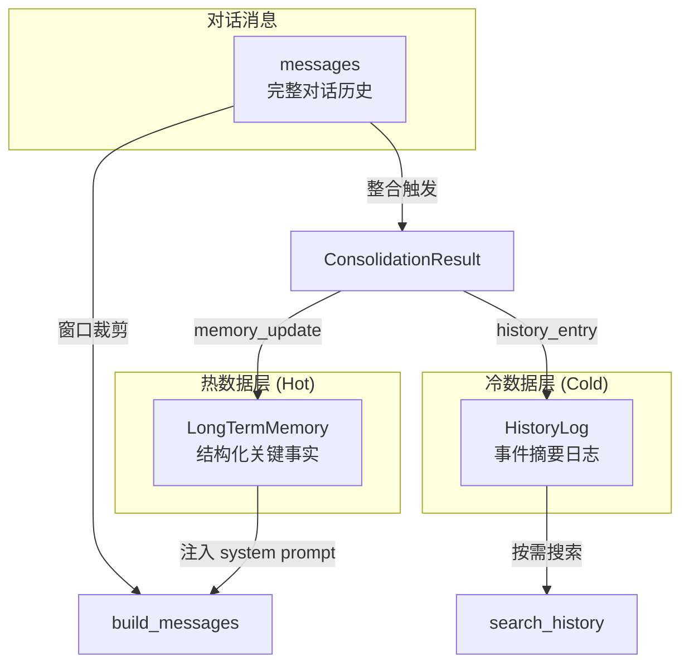
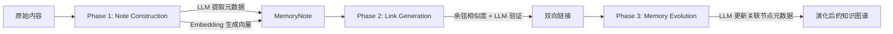

# Memory — 双层记忆架构 + A-MEM 知识图谱

> 最后更新：2026-04-13
> 来源：存量代码分析 + 记忆系统重构 + 代码质量审查 + A-MEM 实现

## 1. 模块概述

Memory 模块定义了会话记忆的统一接口（`Memory` trait）和两种记忆策略：

- **`SlidingWindowMemory`**（已集成）：双层记忆架构，热数据层 + 冷数据层 + 滑动窗口 + 自动整合
- **`AgenticMemoryStore`**（已实现，待集成）：基于 A-MEM 论文的知识图谱记忆引擎，三阶段生命周期 + 向量检索 + 记忆演化

此外，`src/embedding/` 模块提供了 `Embedding` trait 抽象和 OpenAI 实现，为 A-MEM 的向量检索提供基础设施。

## 2. Memory Trait

> 📍 **代码位置**：`src/memory/mod.rs`

```rust
pub trait Memory: Send + Sync {
    fn add_user_message(&mut self, content: &str);
    fn add_assistant_message(&mut self, content: &str);
    fn add_tool_context(&mut self, context: &str) { self.add_assistant_message(context); }
    fn build_messages(&self) -> Vec<ChatMessage>;
    fn clear(&mut self);
    fn should_consolidate(&self) -> bool { false }
    fn turn_count(&self) -> usize;
    fn strategy_name(&self) -> &str;
    fn as_any(&self) -> &dyn Any;
    fn as_any_mut(&mut self) -> &mut dyn Any;
}
```

**设计要点**：
- `add_tool_context()` 有默认实现（委托给 `add_assistant_message`），区分工具上下文和普通助手消息
- `should_consolidate()` 有默认实现（返回 `false`），不支持整合的策略无需重写
- `as_any()` / `as_any_mut()` 提供 downcast 能力，使 Agent 层可以访问策略特定功能（如整合、历史搜索），而不污染基础 trait 接口
- `clear()` 标记为 `#[allow(dead_code)]`，预留给未来的显式记忆重置命令

**`as_any` downcast 设计决策**：

引入 `as_any` 的原因是双层记忆引入了大量策略特定方法（`search_history`、`messages_to_consolidate`、`take_persistent_state` 等），如果全部放入 `Memory` trait 会导致 trait 膨胀，且不支持整合的策略需要提供大量空实现。通过 downcast，基础 trait 保持精简（11 个方法），策略特定功能通过 `as_any_mut().downcast_mut::<SlidingWindowMemory>()` 按需访问。

**权衡**：
- ✅ 基础 trait 不被策略特定方法污染
- ✅ 新增 Memory 实现无需实现不相关的方法
- ⚠️ downcast 失去了编译时类型安全，调用方需要处理 `None` 情况
- ⚠️ 如果未来有第二种支持持久化的 Memory 实现，所有 downcast 点都需要扩展

[置信度：高]

## 3. SlidingWindowMemory — 双层记忆引擎

> 📍 **代码位置**：`src/memory/sliding_window.rs`

### 结构

```
SlidingWindowMemory {
    base_system_prompt: String,       // 原始系统提示词（不含记忆注入）
    messages: Vec<ChatMessage>,       // 完整对话消息历史
    long_term: LongTermMemory,        // 热数据：结构化关键事实
    history_log: Vec<HistoryEntry>,   // 冷数据：事件摘要日志
    consolidation_cursor: usize,      // 整合游标
    config: SlidingWindowConfig,      // 窗口与整合配置
}
```

**命名说明**：字段 `messages`（而非 `history`）与 `build_messages()` 和 `windowed_messages()` 语义对齐，避免与 `history_log` 混淆。字段 `consolidation_cursor`（而非 `last_consolidated`）消除了"最后一条已合并"vs"第一条未合并"的歧义——它是一个游标，指向第一条未合并消息的索引。

### 双层数据流



## 4. Agentic Memory (A-MEM) — 知识图谱记忆引擎

> 📍 **代码位置**：`src/memory/agentic/`
> 📄 **论文**：A-MEM (arxiv:2502.12110)
> ⚠️ **状态**：已实现核心引擎，尚未集成到 ChatAgent 主流程

### 设计动机

SlidingWindowMemory 的双层架构解决了"关键事实不丢失"的问题，但它的知识组织是**扁平的**——长期记忆只是分类列表，缺乏知识之间的关联。A-MEM 引入了**知识图谱**的概念：每条记忆是一个带有丰富元数据的节点（MemoryNote），节点之间通过语义相似性建立双向链接，形成可演化的知识网络。

### 三阶段生命周期

A-MEM 的核心是论文中定义的三阶段记忆生命周期：



1. **Note Construction**：原始内容 → LLM 提取 keywords/tags/context → Embedding 模型生成向量 → 创建 `MemoryNote`
2. **Link Generation**：余弦相似度检索候选节点 → LLM 验证语义关联 → 建立双向链接
3. **Memory Evolution**：新链接建立后 → LLM 重新分析关联节点的元数据 → 更新 keywords/tags/context 以反映高阶知识模式

### 模块结构

```
src/memory/agentic/
├── mod.rs          # 模块入口，re-export MemoryNote + AgenticMemoryStore
├── note.rs         # MemoryNote — 原子知识单元（Zettelkasten 风格）
└── store.rs        # AgenticMemoryStore — 三阶段引擎 + 检索
src/embedding/
├── mod.rs          # Embedding trait + cosine_similarity()
└── openai.rs       # OpenAI text-embedding-3-small 实现
```

### MemoryNote 结构

每个 note 是一个自包含的知识单元：

| 字段 | 类型 | 说明 |
|------|------|------|
| `id` | `Uuid` | 唯一标识 |
| `content` | `String` | 原始内容 |
| `keywords` | `Vec<String>` | LLM 提取的关键词 |
| `tags` | `Vec<String>` | LLM 提取的分类标签 |
| `context` | `String` | LLM 生成的语义描述 |
| `embedding` | `Vec<f32>` | 向量表示（用于相似度检索） |
| `linked_notes` | `HashSet<Uuid>` | 双向链接（知识图谱边） |
| `created_at` / `updated_at` | `DateTime<Local>` | 时间戳 |

### AgenticMemoryStore 配置常量

| 常量 | 默认值 | 说明 |
|------|--------|------|
| `DEFAULT_SIMILARITY_THRESHOLD` | 0.5 | 链接候选的最低余弦相似度 |
| `DEFAULT_MAX_LINK_CANDIDATES` | 5 | 每次链接生成检索的最大候选数 |
| `DEFAULT_RETRIEVAL_LIMIT` | 5 | 上下文检索返回的最大 note 数 |

### Embedding Trait

> 📍 **代码位置**：`src/embedding/mod.rs`

```rust
#[async_trait]
pub trait Embedding: Send + Sync {
    async fn embed(&self, text: &str) -> Result<Vec<f32>>;
    async fn embed_batch(&self, texts: &[&str]) -> Result<Vec<Vec<f32>>>;
    fn dimensions(&self) -> usize;
    fn model_name(&self) -> &str;
}
```

`embed_batch` 有默认实现（顺序调用 `embed`），支持批量 API 的 Provider 可覆盖以提升性能。`cosine_similarity()` 作为模块级函数提供，用于向量相似度计算。

### Prompt 模板分离

A-MEM 的三个 LLM 交互阶段各有独立的 prompt 模板，从业务逻辑中提取为模块级常量和构造函数：

| 常量/函数 | 用途 |
|-----------|------|
| `METADATA_SYSTEM_PROMPT` | 元数据提取的 system prompt |
| `LINK_VALIDATION_SYSTEM_PROMPT` | 链接验证的 system prompt |
| `EVOLUTION_SYSTEM_PROMPT` | 记忆演化的 system prompt |
| `metadata_extraction_prompt()` | 构造元数据提取的 user prompt |
| `link_validation_prompt()` | 构造链接验证的 user prompt |
| `evolution_prompt()` | 构造记忆演化的 user prompt |

**设计决策**：将 prompt 模板与业务逻辑分离，便于调整措辞、支持多语言或 A/B 测试不同 prompt，无需修改核心引擎代码。

### 待完成工作

- [ ] 将 `AgenticMemoryStore` 集成到 `ChatAgent` 主流程（作为可选的第三种记忆策略）
- [ ] 实现持久化存储（当前为纯内存 HashMap）
- [ ] 考虑将 LLM 编排逻辑从 `AgenticMemoryStore` 中拆分（存储 vs 编排职责分离）

[置信度：高]

### build_messages() 逻辑

1. 通过 `effective_system_prompt()` 将 `LongTermMemory` 动态注入到 `base_system_prompt` 末尾
2. 系统消息始终在首位
3. 如果 `max_messages` 为 None → 返回全部消息
4. 如果 `max_messages` 为 Some(n) → 取最后 n 条消息（`windowed_messages()`）

**重要**：长期记忆注入发生在 `build_messages()` 时，而非修改 `base_system_prompt`。这意味着整合更新长期记忆后，下一次 LLM 调用自动看到最新内容，无需重建 session。[置信度：高]

### 整合（Consolidation）机制

> 📍 **代码位置**：`src/memory/sliding_window.rs` + `src/memory/consolidation.rs`

**触发条件**：`unconsolidated_count() >= config.consolidation_threshold`

**整合流程**：
1. `messages_to_consolidate()` 返回需要整合的消息切片（从 `consolidation_cursor` 到 `messages.len() - retention_window`）
2. 外部（Agent 层）调用 LLM 生成 `ConsolidationResult`
3. `apply_consolidation()` 将结果应用：
   - `history_entry` 追加到 `history_log`（冷数据）
   - `memory_update` 替换 `long_term`（热数据）
   - 推进 `consolidation_cursor` 游标

**ConsolidationResult DTO**：
```rust
pub struct ConsolidationResult {
    pub history_entry: HistoryEntry,   // 2-5 句事件摘要
    pub memory_update: LongTermMemory, // 完整替换的长期记忆
}
```

### 持久化状态迁移

> 📍 **代码位置**：`src/memory/sliding_window.rs` + `src/agent/chat.rs`

当 session 重建时（MCP 附加、新会话），长期记忆和历史日志需要跨 session 迁移：

```
旧 session → take_persistent_state() → (LongTermMemory, Vec<HistoryEntry>)
                                              ↓
新 session ← restore_persistent_state(ltm, log) ← memory_factory(prompt)
```

**设计要点**：
- `take_persistent_state()` / `restore_persistent_state()` 是对称的 API 对
- `ChatAgent::create_session_with_migration()` 是唯一执行此流程的方法，`reset_with_updated_prompt()` 和 `new_session()` 都委托给它
- 迁移通过 `as_any_mut().downcast_mut::<SlidingWindowMemory>()` 实现，如果 Memory 实现不支持持久化则静默跳过

[置信度：高]

### 历史搜索

```rust
pub fn search_history(&self, query: &str, limit: Option<usize>) -> Vec<&HistoryEntry>
```

- 大小写不敏感的关键词匹配（summary + keywords）
- `limit: Option<usize>` — `None` 返回全部匹配，`Some(n)` 返回至多 n 条

### 工厂构造

`ChatAgent::new()` 默认使用 `SlidingWindowMemory::with_defaults()`，创建带默认配置的双层记忆实例。

### 测试覆盖

84 个单元测试覆盖：无限模式、窗口内/超窗口/边界条件、pending 消息、清除、长期记忆注入、历史搜索（大小写、关键词、限制）、整合触发/应用、持久化迁移等场景。

## 4. 支撑类型

### LongTermMemory（热数据）

> 📍 **代码位置**：`src/memory/long_term.rs`

结构化的关键事实，分为四个类别：
- `user_preferences` — 用户偏好（如 "prefers Rust"）
- `project_context` — 项目上下文（如 "working on Daedalus CLI agent"）
- `important_decisions` — 重要决策
- `important_notes` — 其他重要笔记

`to_markdown()` 将非空类别渲染为 Markdown 格式，用于注入 system prompt。

### HistoryEntry（冷数据）

> 📍 **代码位置**：`src/memory/history.rs`

追加式事件摘要，包含：
- `timestamp` — 创建时间
- `summary` — 2-5 句摘要
- `keywords` — 用于搜索的关键词列表

### SlidingWindowConfig

> 📍 **代码位置**：`src/memory/config.rs`

| 配置项 | 默认值 | 说明 |
|--------|--------|------|
| `max_messages` | `None`（无限） | 发送给 LLM 的最大消息数 |
| `consolidation_threshold` | 100 | 触发整合的未整合消息数 |
| `retention_window` | 50 | 整合时保留的最近消息数 |

---

*变更历史*
| 日期 | 变更 | 来源 |
|------|------|------|
| 2026-04-13 | 重写：反映双层记忆架构重构（热/冷数据层、整合机制、持久化迁移、as_any downcast、代码质量改进） | 记忆系统重构 + 代码质量审查 |
| 2026-04-08 | 初始创建 | 存量代码分析 Phase A |
